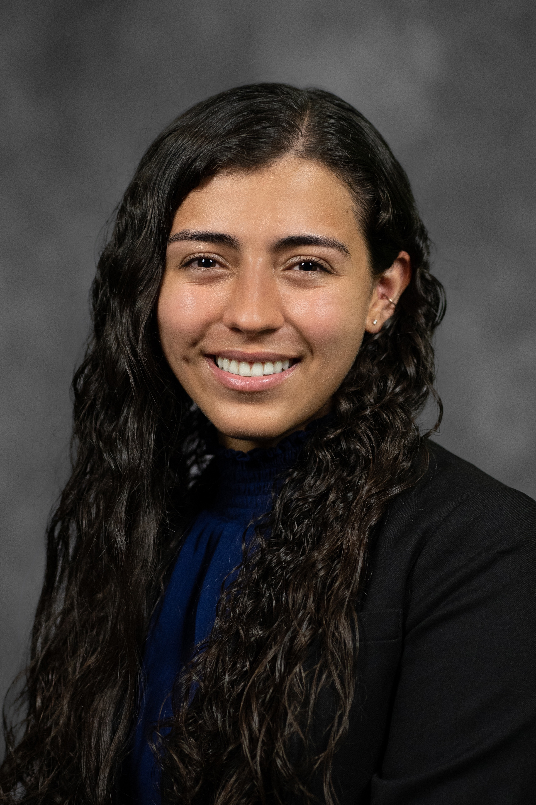

```{r setup, include=FALSE}
knitr::opts_chunk$set(echo = FALSE, warning = FALSE, message = FALSE)
```
## [Home](https://annettelewis.github.io/) | [Projects](https://annettelewis.github.io/projects/) | [Final Project](https://annettelewis.github.io/final_project/)

### Biology Bachelor's Dec 2023 | Self-Motivated Learner | Aspiring Researcher

## 🌱 Biology Bachelor's Dec 2023 | Utah Valley University (UVU)
## 📚 Committed to Excellence | Graduated High School Early | Earned University Studies Associate’s
## 💻 Proficient in RStudio | Data Analysis Enthusiast
## 🔬 Passionate about Advancing Biological Research | Seeking Opportunities in Biotechnology
## 🌿 Curious Latina Scientist with a Love for Nature and Discovery

Hi, My name is Annette! I am an upcoming biology graduate from Utah Valley University (UVU) with an expected completion date in December 2023. I am driven by a deep passion for scientific exploration and discovery. I take pride in my commitment to education, having achieved an early graduation from high school and successfully completed a two-year degree in University Studies at UVU in 2021.

My academic journey has fostered a strong foundation in data analysis, and I am proficient in utilizing RStudio for conducting research and analyzing complex biological data. I am eager to contribute my skills to biology projects that hold the potential to make a positive impact on society.

My aspirations lie in advancing biological research, unraveling the mysteries of the natural world, and applying scientific knowledge to improve human health and well-being. I believe that diversity drives innovation, and as a Latina scientist, I am dedicated to promoting inclusivity and collaboration within the scientific community.

Let's connect and explore new opportunities together! I am excited to contribute my expertise and continue my growth as a biologist and researcher.

**These are not updated yet!**

Here is my [LinkedIn](https://www.linkedin.com/in/annette-lewis-68314b216/)

Here is my [resume](http://annettelewis.github.io/media/Resume.pdf)

I love to play the violin in my free time, it's fun!

```{r, out.height= 300, out.width = 200}
 # 2996x4494
```

### I can do coding things!

Here's the mpg dataset:
```{r message=FALSE, include=TRUE}
library(tidyverse)
library(kableExtra)
library(plotly)
mpg %>% 
  kable() %>% 
  kable_classic(lightable_options = 'hover') %>% 
  scroll_box(width = "500px", height = "200px")

p <- mpg %>% 
  ggplot(aes(x= displ, y= cty)) +
  geom_point() +
  geom_smooth()
ggplotly(p)

round(mean(mpg$cty), 2)

```
<br><br><br>

---

The mean city miles per gallon is **`r round(mean(mpg$cty), 2)`** in this dataset

---

**Music Links**

[Hand Exercises](https://youtu.be/TSrfB7JIzxY)

[Best Part Karaoke](https://www.youtube.com/watch?v=cpzT2M2x_Kw) 

[Just The Two of Us Karaoke](https://www.youtube.com/watch?v=bgtb1G9R0P8)

[Let Us Adore You (Reprise) Sheet Music](https://musescore.com/user/115287/scores/5701224)

```{bash, message = FALSE, include = FALSE}
git add index.Rmd
git commit -m "automatic"
git push
```
