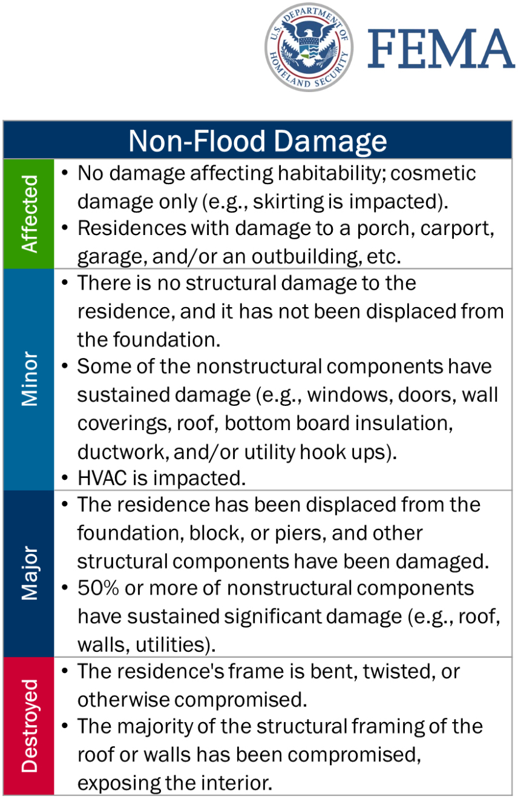

```{r setup, include=FALSE}
knitr::opts_chunk$set(echo = FALSE, message = FALSE, warning = FALSE)
```

## [Home](https://annettelewis.github.io/) | [About Me](https://annettelewis.github.io/about_me/) | [Projects](https://annettelewis.github.io/projects/)

## **Information on data:**
The following data is on New Orleans tornado building damage during December 2022. This data was obtained from Verisk Analytics and it was derived computer vision and machine learning using post-catastrophe aerial imagry data. There are approximately 42,000 buildings in this dataset. 

---

```{r, include = FALSE}
knitr::opts_chunk$set(echo = FALSE, message = FALSE, warning = FALSE)
library(tidyverse)
library(janitor)
library(leaflet)
library(easystats)
library(modelr)
# library(ggmap)
# library(sf)
# library(GGally)
# library(plotly)
library(kableExtra)
library(patchwork)
library(stringr)
library(htmltools)
library(devtools)
library(car)
# library(htmlwidgets)
# library(webshot2)
theme_set(theme_minimal())

# Functions
create_popup <- function(data) {
  paste("<b>Location</b><br>",
        "&nbsp;&nbsp;&nbsp;Longitude: ", data$long, "<br>",
        "&nbsp;&nbsp;&nbsp;Latitude: ", data$lat, "<br>",
        "<b>Catastrophe Score</b><br>",
        "&nbsp;&nbsp;&nbsp;Score: ", data$catastrophescore, "<br>",
        "<b>Roof Shape</b><br>",
        "&nbsp;&nbsp;&nbsp;Shape: ", str_to_title(data$roofshape), "<br>",
        "<b>Roof Material</b><br>",
        "&nbsp;&nbsp;&nbsp;Material: ", str_to_title(data$roofmateri), "<br>")
}

r_med_sq_err <- function(model, absolute = FALSE){ # adding in the option for an absolute error
  if(sum(class(model) %in% c("glm","lm")) > 0){
    if(absolute == TRUE){
      median(abs(residuals(model)))
    }
    sqrt(median(residuals(model)^2))
  } else {
    if(class(model) == "list"){
      stop("Did you provide a list of models? Use map() instead.")
    }
    stop("'model' must be either a glm or lm object.")
  }
}
```

```{r, out.width = 300}
 # 884×1334
# Do I want to include this??? I might just want to explain some parts of it because I don't reference FEMA scores anywhere else
```

### Before and after:

Here are some interactive before and after aerial images that were taken

```{r}
HTML('
<link href="./twentytwenty.css" rel="stylesheet" type="text/css" />
<p> This is an example of a building that has a catastrophe score of 100 (FEMA 6 / Destroyed) </p>
<div style="width:700px;">
		<div class="twentytwenty-container">
			
			
		</div>
	</div>
	<br>
<p> This is another example of a building that has a catastrophe score of 100 (FEMA 6 / Destroyed) </p>
<div style="width:700px;">
		<div class="twentytwenty-container">
			
			
		</div>
	</div>
	<br>
<p> This is an example of a building that has a catastrophe score of approximately 60 (FEMA 4 / Major) </p>
<div style="width:700px;">
		<div class="twentytwenty-container">
			
			
		</div>
	</div>
')
```

```{r, echo = FALSE, results = 'asis'}
cat('<script src="./jquery.event.move.js"></script>')
cat('<script src="./jquery.twentytwenty.js"></script>')
```

```{js}
  $(function(){
	$(".twentytwenty-container[data-orientation!='vertical']").twentytwenty({default_offset_pct: 0.7});
	$(".twentytwenty-container[data-orientation='vertical']").twentytwenty({default_offset_pct: 0.3, orientation: 'vertical'});
  });
```

## **Clean data:**

I converted roof_solar into a T/F statement, by converting "SOLAR PANEL" to TRUE and "NO SOLAR PANEL" to FALSE. In addition to this, I converted the roof shapes that the computer wasn't very sure about (up to a 20% chance of being incorrect) into NA. There were some cells in damage_level where they were filled with an empty character, so I converted that into NA as well. I then separated longitude and latitude so that it could be easily read into leaflet. 

```{r, echo=TRUE, message = TRUE}
df <- read.csv("clean_data.csv") %>% 
  janitor::clean_names() %>% 
  mutate(roofsolar = case_when(roofsolar == "SOLAR PANEL" ~ TRUE)) %>%
  mutate(roofshape = ifelse(roofshascr < 0.80, NA, roofshape)) %>%
  select(-c(roofshascr, roofcondit_discolordetect, roofcondit_discolorscore, roofcondit_discolorpercen, trampscr, roofcondit_tarppercen))

df$rooftopgeo <- gsub("POINT \\(|\\)", "", df$rooftopgeo)

df <- df %>%
  separate(rooftopgeo, into = c("long", "lat"), sep = " ", convert = TRUE)

df$damage_level <- ifelse(df$damage_level == "", NA, df$damage_level)
df$roofshape <- factor(df$roofshape, levels = c("gable", "hip", "flat"))
levels_roofmateri <- c("metal", "shingle", "membrane", "shake", "tile")
df$roofmateri <- factor(df$roofmateri, levels = c("gravel", levels_roofmateri))
df$roofmateri <- factor(df$roofmateri, levels = levels_roofmateri)
```
---

```{r}
# df %>%
#   select(-buildings_ids) %>%
#   kable() %>%
#   kable_classic(lightable_options = "hover") %>%
#   scroll_box(height = "200px")

# Note that kable extra will understand html

# MIGHT BE NICE TO MESS WITH THIS TABLE... IF NOT, I JUST WON'T INCLUDE BUILDING IDS FOR MY FINAL PROJECT, THEY CAN SEE IT IN THE DATAFRAME IF THEY ARE REALLY THAT INTERESTED.....
# df$buildings_ids %>% str_trunc(30, ellipsis = "...") #this can be used to shorten it
# 
# df %>%
#   kable() %>%
#   kable_classic(lightable_options = "hover") %>%
#   scroll_box(height = "200px")
# 
# df %>%
#   kableExtra::kable(),
# kableExtra::kable_classic(), 
# kableExtra::scroll_box(), 
# kableExtra::cell_spec()
```

### Define damage categories:

**Catastrophe scores are separated by the summary of the dataset, excluding the catastrophe scores of 0.**
```{r, echo = TRUE}
mostdamage <- df %>% filter(catastrophescore >= 50)
nodamage <- df %>% filter(catastrophescore == 0)
decimated <-df %>% filter(catastrophescore == 100)
middamage <- df %>% filter(catastrophescore < 50 & catastrophescore >= 15)
leastdamage <- df %>% filter(catastrophescore < 15 & catastrophescore >= 2)
minimaldamage <- df %>% filter(catastrophescore == 1)
```

## **Damage maps:**

**NOTE:** Red indicates the buildings that were the most damaged (catastrophe score >= 50), orange indicates (25 < catastrophe score < 50), blue indicates (catastrophe score <= 25, excluding scores of 0). Only 3852 buildings experienced a nonzero catastrophe score, so the majority of the buildings (37,967) exhibited a catastrophe score of 0.

### All points:

This shows all of the catastrophe scores, the vast majority of roofs have no damage.

```{r, out.height= 450, out.width = 675}
# alldamage <- leaflet(options = leafletOptions(zoomControl = FALSE)) %>%
#   addTiles() %>%
#   addCircleMarkers(lng=mostdamage$long, lat=mostdamage$lat, color = "red", radius = 2) %>%
#   addCircleMarkers(lng=middamage$long, lat=middamage$lat, color = "orange", radius = 2) %>%
#   addCircleMarkers(lng=leastdamage$long, lat=leastdamage$lat, color = "blue", radius = 2) %>%
#   addCircleMarkers(lng=nodamage$long, lat=nodamage$lat, color = "gray", radius = .5) %>%
#   setMaxBounds(lng1 = min(mostdamage$long, middamage$long, leastdamage$long, nodamage$long),
#                lat1 = min(mostdamage$lat, middamage$lat, leastdamage$lat, nodamage$lat),
#                lng2 = max(mostdamage$long, middamage$long, leastdamage$long, nodamage$long),
#                lat2 = max(mostdamage$lat, middamage$lat, leastdamage$lat, nodamage$lat))
# alldamage_map <- saveWidget(alldamage, file = "alldamage_map.html", selfcontained = TRUE)
# webshot2::webshot("alldamage_map.html", "alldamage_map.png", cliprect = "viewport", zoom = 5)

knitr::include_graphics("./maps/alldamage.png")
```

---

### Least damage:

Map of the buildings that experienced the least damage:

```{r, out.height= 450, out.width = 675}
# least <- leaflet(options = leafletOptions(zoomControl = FALSE)) %>%
#   addTiles() %>%
#   addCircleMarkers(lng=leastdamage$long, lat=leastdamage$lat, color = "blue", radius = 2,
#                    popup = create_popup(leastdamage))
# leastdamage_map <- saveWidget(least, file = "leastdamage_map.html", selfcontained = TRUE)
# webshot2::webshot("leastdamage_map.html", "leastdamage_map.png", cliprect = "viewport", zoom = 5)

knitr::include_graphics("./maps/leastdamage.png")
```

### Mid damage:

Map of the buildings that experienced mid damage:

```{r, out.height= 450, out.width = 675}
# damage <- leaflet(options = leafletOptions(zoomControl = FALSE)) %>%
#   addTiles() %>%
#   addCircleMarkers(lng=mostdamage$long, lat=mostdamage$lat, color = "red", radius = 2, popup = create_popup(mostdamage)) %>%
#   addCircleMarkers(lng=middamage$long, lat=middamage$lat, color = "orange", radius = 2, popup = create_popup(middamage)) %>%
#   addCircleMarkers(lng=leastdamage$long, lat=leastdamage$lat, color = "blue", radius = 2, popup = create_popup(leastdamage))
# damage_map <- saveWidget(damage, file = "damage_map.html", selfcontained = TRUE)
# webshot2::webshot("damage_map.html", "damage_map.png", cliprect = "viewport", zoom = 5)

knitr::include_graphics("./maps/damage.png")
```

### Most damage:

Map of the buildings that experienced the most damage (interactive!):

```{r}
high <- leaflet() %>%
  addTiles() %>%
  addCircleMarkers(lng = mostdamage$long, lat = mostdamage$lat, color = "red", radius = 2, 
                   popup = create_popup(mostdamage))
high
```

### No damage:
Map of the buildings that experienced no damage:

```{r, out.height= 450, out.width = 675}
# none <- leaflet(options = leafletOptions(zoomControl = FALSE)) %>%
#   addTiles() %>%
#   addCircleMarkers(lng=nodamage$long, lat=nodamage$lat, color = "gray", radius = .5,
#                    popup = create_popup(nodamage))
# none_map <- saveWidget(none, file = "none_map.html", selfcontained = TRUE)
# webshot2::webshot("none_map.html", "none_map.png", cliprect = "viewport", zoom = 5)


```

### Destroyed:

Map of the buildings that were completely destroyed:

```{r}
destroyed <- leaflet() %>%
  addTiles() %>%
  addCircleMarkers(lng=decimated$long, lat=decimated$lat, color = "#800000", radius = 2,
                   popup = create_popup(decimated))
destroyed
```

---

## **Models:**

Since most of the buildings in this dataset were not damaged by a tornado, the summary of the catastrophe scores of each building is skewed. This can be seen below:

```{r}
summary(df$catastrophescore)

# mod1 <- glm(formula = catastrophescore ~ long + lat + rooftree + roofshape, data = df, family = "gaussian")
# mod2 <- glm(formula = catastrophescore ~ long + enclosure + rooftree + roofmateri, data = df, family = "gaussian")
# mod3 <- glm(formula = catastrophescore ~ long + lat + roofshape + rooftree, data = df, family = "gaussian")
# mod4 <- glm(formula = catastrophescore ~ long + roofsolar + roofmateri, data = df, family = "gaussian")
# mod5 <- glm(formula = catastrophescore ~ long + enclosure + roofshape, data = df, family = "gaussian")
# mod6 <- glm(formula = catastrophescore ~ long + lat + roofshape + rooftree, data = df, family = "gaussian")
# 
# compare_performance(mod1, mod2, mod3, mod4, mod5, mod6) %>% plot()
# compare_performance(mod1, mod2, mod3, mod4, mod5, mod6)

# rmse(mod1, df)
# rmse(mod2, df)
# rmse(mod3, df)
# rmse(mod4, df)
# rmse(mod5, df)
# rmse(mod6, df)

# # Median square error for all of the models:
# r_med_sq_err(mod1)
# r_med_sq_err(mod2)
# r_med_sq_err(mod3) # appears to have the lowest med sqr error out ove everything
# r_med_sq_err(mod4)
# r_med_sq_err(mod5)
# r_med_sq_err(mod6)
```

### Check models: Extra

**Due to this, I made models that excluded the catastrophe scores of 0 to just look into the structures that experienced damage. Below is the summary for the structures that exhibited damage:**

```{r}
extra <- df %>% filter(catastrophescore != 0)
summary(extra$catastrophescore)
```

**Models**

```{r}
mods1 <- glm(formula = catastrophescore ~ long + roofshape + rooftree + enclosure, data = extra, family = gaussian(link = "identity"))
mods2 <- glm(formula = catastrophescore ~ long + roofshape + enclosure + rooftree, data = extra, family = gaussian(link = "identity"))
mods3 <- glm(formula = catastrophescore ~ long + roofshape + enclosure + roofmateri, data = extra, family = gaussian(link = "identity"))
mods4 <- glm(formula = catastrophescore ~ long + roofmateri, data = extra, family = gaussian(link = "identity"))
mods5 <- glm(formula = catastrophescore ~ long + roofmateri + rooftree + enclosure, data = extra, family = gaussian(link = "identity"))
compare_performance(mods1, mods2, mods3, mods4, mods5) %>% plot()
compare_performance(mods1, mods2, mods3, mods4, mods5)

# check_model(mods1) # Kinda matches, some irregularities
# # check_model(mods2) # fucked homogeneity
# check_model(mods3) # not horrible, but linearity and homogeneity of variance don't fit too well
# check_model(mods4) # Actually kinda works.. but very questionable
# check_model(mods5) # might work
```

**Out of the models I made, *Model 3* appeared to work best. Though it should be noted that none of these models fit particularly well based on the variables used.**

**Model 3**

```{r}
check_model(mods3, type = "pearson")
summary(mods5)
vif(mods5)
```
Root mean squared error for Model 3
```{r}
rmse(mods3, df)
```

---

## **Predictions:**

**Based on *Model 3*, I have made model predictions:**

```{r}
prediction <- add_predictions(extra, mods3, type = "response") %>% select(pred)
# extra %>% add_column(prediciton)

pred <- add_predictions(extra, mods3, type = "response") %>% select(pred)
extra <- extra %>% add_column(pred)

comparison <- extra %>% select(catastrophescore, pred)
```

**Here is a comparison of the predicted vs the actual catastrophe score:**

```{r}
# comparison %>%
#   kable() %>%
#   kable_classic(lightable_options = "hover") %>%
#   scroll_box(height = "200px")
```

**I then plotted the predicted catastrophe scores alongside the actual catastrophe scores for reference.**

```{r}
p1 <- ggplot(extra, aes(x = long, y = lat, color = as.numeric(unlist(pred)))) +
  geom_point() +
  geom_point(data = extra, aes(x = long, y = lat)) +
  labs(x = "Longitude", 
       y = "Latitude", 
       title = "Predicted Points",
       color = "Predicted Catastrophe Score") +
  scale_color_gradient(low = "blue", high = "red", limits = c(0, 100))

p2 <- ggplot(extra, aes(x = long, y = lat, color = as.numeric(catastrophescore))) +
  geom_point() +
  geom_point(data = extra, aes(x = long, y = lat)) +
  scale_color_gradient(low = "blue", high = "red", limits = c(0, 100)) +
  labs(x = "Longitude", 
       y = "Latitude", 
       title = "Actual Points",
       color = "Catastrophe Score")
p1/p2
```

---

## **Interpretations:**

The variables included in this dataset were shown to not be entirely helpful in predicting catastrophe scores accurately, which is exemplified in the graph above. More information would need to be considered, specifically, taking a look into tornadoes.

---

## Graphs:

```{r}
# This shows another representation of the data points (map w/o leaflet)
# I would want to change the colors (they don't match well)
# messing %>% 
#   ggplot(aes(x=long, y=lat, color = damage_level)) +
#   geom_point()
# # based on long and lat, respectively. i would want to remove the NA
# df %>% 
#   ggplot(aes(x=long, y=catastrophescore, color = damage_level)) +
#   geom_point() + facet_wrap(~roofmateri)
# 
# df %>% 
#   ggplot(aes(x=lat, y=catastrophescore, color = damage_level)) +
#   geom_point() + facet_wrap(~roofmateri)
# 
# df %>% 
#   ggplot(aes(x=rooftree, y=catastrophescore, color = damage_level)) +
#   geom_point()
# 
# df %>% 
#   filter(na.rm(df$poolarea)) %>% 
#   ggplot(aes(x=poolarea, y=catastrophescore)) +
#   geom_point()
# 
# df %>% 
#   ggplot(aes(x=catastrophescore, y=roofcondit_missingmaterialpercen, color = damage_level)) +
#   geom_point()
# 
# messing %>% 
#   ggplot(aes(x=catastrophescore, y=roofcondit_structuraldamagepercen, color = damage_level)) +
#   geom_point()
```