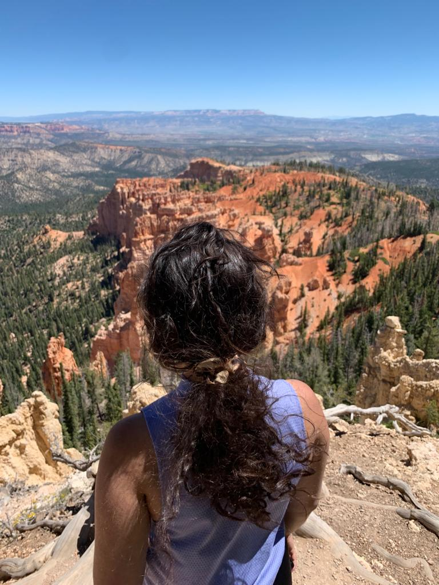

```{r setup, include=FALSE}
knitr::opts_chunk$set(echo = FALSE, message = FALSE, warning = FALSE)
```

```{css}
body {
  background-color: #88b3b3;
}

#contact-information {
  background-color: white;
  border-radius: 5px;
  margin: 15px;
  padding: 10px;
}
```

## [About Me](https://annettelewis.github.io/about_me/) | [Projects](https://annettelewis.github.io/projects/) | [Example of Code](https://annettelewis.github.io/projects/BIOL_3100_final_project/)

### Contact Information:

#### Annette Lewis

#### annette.lewis@gmail.com

#### [LinkedIn](https://www.linkedin.com/in/annette-lewis-68314b216/)

```{r, out.height= 500, out.width= 375}
 
# 768×1024
``` 