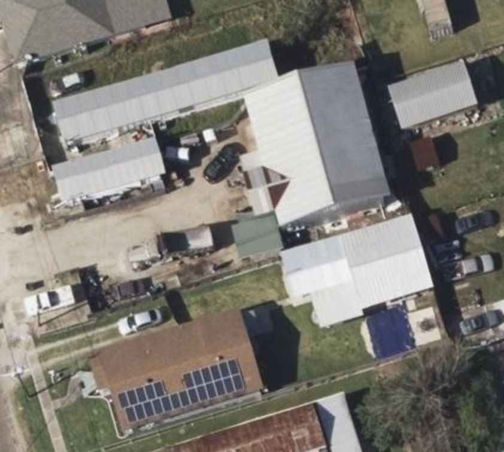
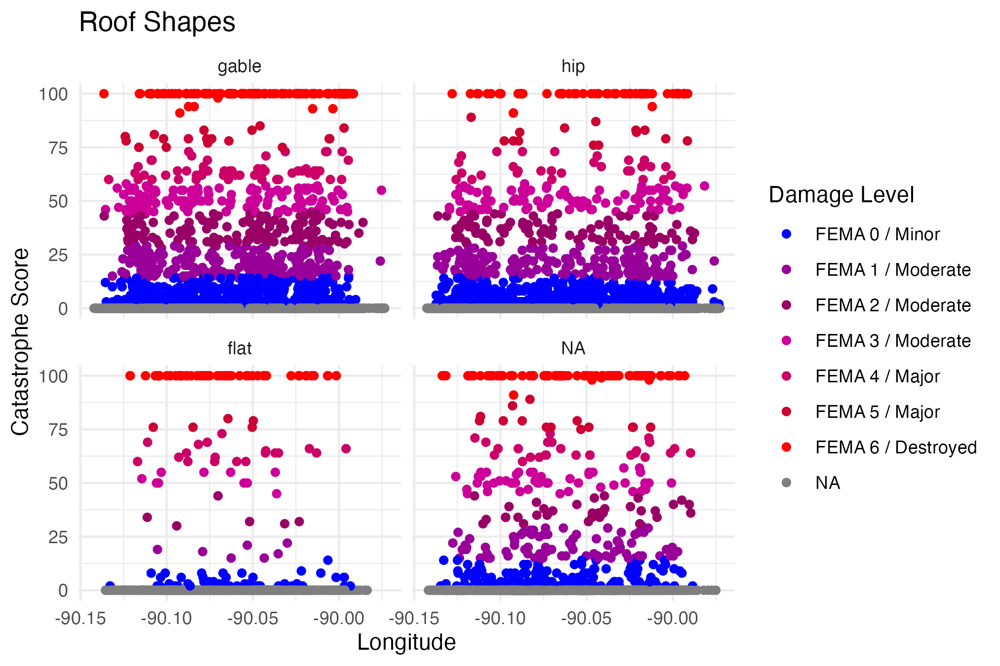
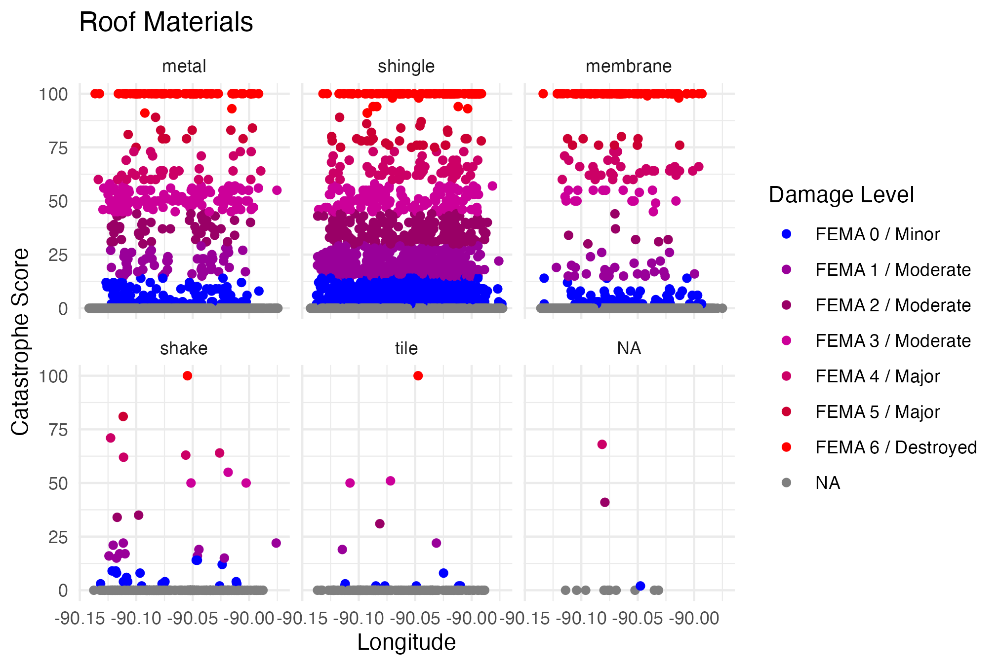
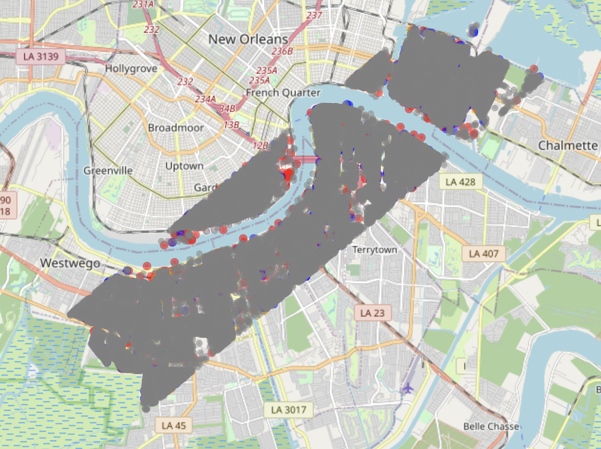
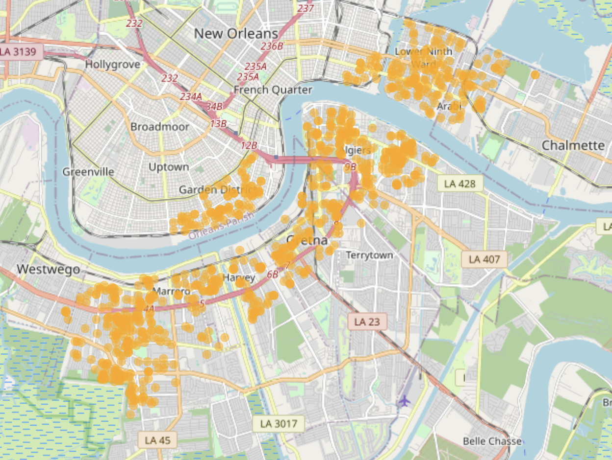

```{r setup, include=FALSE}
knitr::opts_chunk$set(echo = FALSE, message = FALSE, warning = FALSE)
```

```{css}
body {
  background-color: #d4caa3;
}

#information-on-data {
  background-color: white;
  border-radius: 5px;
  margin: 15px;
  padding: 10px;
}
#clean-data {
  background-color: white;
  border-radius: 5px;
  margin: 15px;
  padding: 10px;
}
#damage-maps {
  background-color: white;
  border-radius: 5px;
  margin: 15px;
  padding: 10px;
}
#investigation {
  background-color: white;
  border-radius: 5px;
  margin: 15px;
  padding: 10px;
}
#predictions {
  background-color: white;
  border-radius: 5px;
  margin: 15px;
  padding: 10px;
}
#interpretations {
  background-color: white;
  border-radius: 5px;
  margin: 15px;
  padding: 10px;
}
```

## [Home](https://annettelewis.github.io/) | [About Me](https://annettelewis.github.io/about_me/) | [Projects](https://annettelewis.github.io/projects/)


## **Information on data**
The following data is on New Orleans tornado building damage during December 2022. This data was obtained from Verisk Analytics and it was derived computer vision and machine learning using post-catastrophe aerial imagry data. There are approximately 42,000 buildings in this dataset. 

```{r, echo = TRUE, message = FALSE}
knitr::opts_chunk$set(echo = FALSE, message = FALSE, warning = FALSE)
library(tidyverse)
library(janitor)
library(leaflet)
library(easystats)
library(modelr)
library(kableExtra)
library(patchwork)
library(stringr)
library(htmltools)
library(devtools)
library(RColorBrewer)
# library(htmlwidgets)
# library(webshot2)
theme_set(theme_minimal())

# Functions
create_popup <- function(data) {
  paste("<b>Location</b><br>",
        "&nbsp;&nbsp;&nbsp;Longitude: ", data$long, "<br>",
        "&nbsp;&nbsp;&nbsp;Latitude: ", data$lat, "<br>",
        "<b>Catastrophe Score</b><br>",
        "&nbsp;&nbsp;&nbsp;Score: ", data$catastrophescore, "<br>",
        "<b>Roof Shape</b><br>",
        "&nbsp;&nbsp;&nbsp;Shape: ", str_to_title(data$roofshape), "<br>",
        "<b>Roof Material</b><br>",
        "&nbsp;&nbsp;&nbsp;Material: ", str_to_title(data$roofmateri), "<br>")
}

r_med_sq_err <- function(model, absolute = FALSE){ # adding in the option for an absolute error
  if(sum(class(model) %in% c("glm","lm")) > 0){
    if(absolute == TRUE){
      median(abs(residuals(model)))
    }
    sqrt(median(residuals(model)^2))
  } else {
    if(class(model) == "list"){
      stop("Did you provide a list of models? Use map() instead.")
    }
    stop("'model' must be either a glm or lm object.")
  }
}
```

### FEMA scores

Here is some general information on what each type of score means in the context of tornado roof damage:

```{r, out.width = 300, fig.align='center'}
knitr::include_graphics("./maps/fema.jpg") # 884×1334
```

---

### Before and after **(interactive)**

```{r}
HTML('
<link href="./twentytwenty.css" rel="stylesheet" type="text/css" />
<p> <i> Aerial image of a building that has a catastrophe score of 100 (FEMA 6 / Destroyed) </i> </p>
<div style="width:700px;">
		<div class="twentytwenty-container">
			
			
		</div>
	</div>
	<br>
<hr>
<p> <i> Another aerial image of a building that has a catastrophe score of 100 (FEMA 6 / Destroyed) </i> </p>
<div style="width:700px;">
		<div class="twentytwenty-container">
			
			
		</div>
	</div>
	<br>
<hr>
<p> <i> Aerial image of a building that has a catastrophe score of approximately 60 (FEMA 4 / Major) </i> </p>
<div style="width:700px;">
		<div class="twentytwenty-container">
			
			
		</div>
	</div>
')
```

```{r, echo = FALSE, results = 'asis'}
cat('<script src="./jquery.event.move.js"></script>')
cat('<script src="./jquery.twentytwenty.js"></script>')
```

```{js}
  $(function(){
	$(".twentytwenty-container[data-orientation!='vertical']").twentytwenty({default_offset_pct: 0.7});
	$(".twentytwenty-container[data-orientation='vertical']").twentytwenty({default_offset_pct: 0.3, orientation: 'vertical'});
  });
```

## **Clean data**

I converted roof_solar into a T/F statement, by converting "SOLAR PANEL" to TRUE and "NO SOLAR PANEL" to FALSE. In addition to this, I converted the roof shapes that the computer wasn't very sure about (up to a 20% chance of being incorrect) into NA. There were some cells in damage_level where they were filled with an empty character, so I converted that into NA as well. I then separated longitude and latitude so that it could be easily read into leaflet. 

```{r, echo = TRUE, message = TRUE}
df <- read.csv("clean_data.csv") %>% 
  janitor::clean_names() %>% 
  mutate(roofsolar = case_when(roofsolar == "SOLAR PANEL" ~ TRUE)) %>%
  mutate(roofshape = ifelse(roofshascr < 0.80, NA, roofshape)) %>%
  select(-c(roofshascr, roofcondit_discolordetect, roofcondit_discolorscore, roofcondit_discolorpercen, trampscr, roofcondit_tarppercen))

df$rooftopgeo <- gsub("POINT \\(|\\)", "", df$rooftopgeo)

df <- df %>%
  separate(rooftopgeo, into = c("long", "lat"), sep = " ", convert = TRUE)

df$damage_level <- ifelse(df$damage_level == "", NA, df$damage_level)
df$roofshape <- factor(df$roofshape, levels = c("gable", "hip", "flat"))
levels_roofmateri <- c("metal", "shingle", "membrane", "shake", "tile")
df$roofmateri <- factor(df$roofmateri, levels = c("gravel", levels_roofmateri))
df$roofmateri <- factor(df$roofmateri, levels = levels_roofmateri)
```
---

Catastrophe score is an aggregate of missing material, structural damage, and a few other attributes. This table includes the information of 5,000 roofs.

```{r}
df_subset <- df %>% 
             slice(1:5000)

df_subset %>% 
  select(-buildings_ids) %>% 
  kable() %>%
  kable_classic(lightable_options = "hover") %>%
  scroll_box(height = "200px")
```

---

### Building characteristics

Typically, insurance agencies consider gable roof shapes as more prone to damage than hip roof shapes. This graph illustrates the proportion of roofs of a certain shape:

```{r, include = TRUE, fig.align='center', fig.width = 675}
# colors <- c("gray", "blue", "#990099", "#990066", "#CC0099", "#CC0066", "#CC0033", "red")
# 
# color_map <- setNames(colors, c(NA, "FEMA 0 / Minor", "FEMA 1 / Moderate", "FEMA 2 / Moderate", "FEMA 3 / Moderate",  "FEMA 4 / Major", "FEMA 5 / Major", "FEMA 6 / Destroyed"))
# 
# df %>%
#   ggplot(aes(x=long, y=catastrophescore, color = damage_level)) +
#   geom_point() + facet_wrap(~roofshape) +
#   labs(title = "Roof Shapes", x = "Longitude", y = "Catastrophe Score", color = "Damage Level") +
#   scale_color_manual(values = color_map)

```

In addition to this, shingle roofs are more easily damaged than metal or tile roofs, which is important to keep in mind because shingle roofs are used extremely often in the states. The graph below illustrates the proportion of roofs made with a certain material (shingle roofs clearly are most prominent):

```{r, include = TRUE, fig.align='center', fig.width = 675}
# df %>%
#   ggplot(aes(x=long, y=catastrophescore, color = damage_level)) +
#   geom_point() + facet_wrap(~roofmateri) +
#   labs(title = "Roof Materials", x = "Longitude", y = "Catastrophe Score", color = "Damage Level") +
#   scale_color_manual(values = color_map)

```

## **Damage maps**

Catastrophe scores are separated based on the summary of the data set, excluding the catastrophe scores of 0 (which is shown in the *Models* section):
```{r, echo = TRUE}
mostdamage <- df %>% filter(catastrophescore >= 50)
nodamage <- df %>% filter(catastrophescore == 0)
decimated <-df %>% filter(catastrophescore == 100)
middamage <- df %>% filter(catastrophescore < 50 & catastrophescore >= 15)
leastdamage <- df %>% filter(catastrophescore < 15 & catastrophescore >= 2)
```

Click on this box if you'd like to see the code for the leaflet maps:
```{r, echo = TRUE, message = TRUE}
# alldamage <- leaflet(options = leafletOptions(zoomControl = FALSE)) %>%
#   addTiles() %>%
#   addCircleMarkers(lng=mostdamage$long, lat=mostdamage$lat, color = "red", radius = 2) %>%
#   addCircleMarkers(lng=middamage$long, lat=middamage$lat, color = "orange", radius = 2) %>%
#   addCircleMarkers(lng=leastdamage$long, lat=leastdamage$lat, color = "blue", radius = 2) %>%
#   addCircleMarkers(lng=nodamage$long, lat=nodamage$lat, color = "gray", radius = .5) %>%
#   setMaxBounds(lng1 = min(mostdamage$long, middamage$long, leastdamage$long, nodamage$long),
#                lat1 = min(mostdamage$lat, middamage$lat, leastdamage$lat, nodamage$lat),
#                lng2 = max(mostdamage$long, middamage$long, leastdamage$long, nodamage$long),
#                lat2 = max(mostdamage$lat, middamage$lat, leastdamage$lat, nodamage$lat))
# alldamage_map <- saveWidget(alldamage, file = "alldamage.html", selfcontained = TRUE)
# webshot2::webshot("alldamage.html", "alldamage.png", cliprect = "viewport", zoom = 5)
#------------------------

# none <- leaflet(options = leafletOptions(zoomControl = FALSE)) %>%
#   addTiles() %>%
#   addCircleMarkers(lng=nodamage$long, lat=nodamage$lat, color = "gray", radius = .5,
#                    popup = create_popup(nodamage))
# none_map <- saveWidget(none, file = "none.html", selfcontained = TRUE)
# webshot2::webshot("none.html", "none.png", cliprect = "viewport", zoom = 5)
#------------------------

# damage <- leaflet(options = leafletOptions(zoomControl = FALSE)) %>%
#   addTiles() %>%
#   addCircleMarkers(lng=mostdamage$long, lat=mostdamage$lat, color = "red", radius = 2, popup = create_popup(mostdamage)) %>%
#   addCircleMarkers(lng=middamage$long, lat=middamage$lat, color = "orange", radius = 2, popup = create_popup(middamage)) %>%
#   addCircleMarkers(lng=leastdamage$long, lat=leastdamage$lat, color = "blue", radius = 2, popup = create_popup(leastdamage))
# damage_map <- saveWidget(damage, file = "damage.html", selfcontained = TRUE)
# webshot2::webshot("damage.html", "damage.png", cliprect = "viewport", zoom = 5)
#------------------------

# least <- leaflet(options = leafletOptions(zoomControl = FALSE)) %>%
#   addTiles() %>%
#   addCircleMarkers(lng=leastdamage$long, lat=leastdamage$lat, color = "blue", radius = 2,
#                    popup = create_popup(leastdamage))
# leastdamage_map <- saveWidget(least, file = "leastdamage.html", selfcontained = TRUE)
# webshot2::webshot("leastdamage.html", "leastdamage.png", cliprect = "viewport", zoom = 5)
#------------------------

# damage <- leaflet(options = leafletOptions(zoomControl = FALSE)) %>%
#   addTiles() %>%
#   addCircleMarkers(lng=mostdamage$long, lat=mostdamage$lat, color = "red", radius = 2, popup = create_popup(mostdamage)) %>%
#   addCircleMarkers(lng=middamage$long, lat=middamage$lat, color = "orange", radius = 2, popup = create_popup(middamage)) %>%
#   addCircleMarkers(lng=leastdamage$long, lat=leastdamage$lat, color = "blue", radius = 2, popup = create_popup(leastdamage))
# damage_map <- saveWidget(damage, file = "damage.html", selfcontained = TRUE)
# webshot2::webshot("damage.html", "damage.png", cliprect = "viewport", zoom = 5)
#------------------------

high <- leaflet() %>%
  addTiles() %>%
  addCircleMarkers(lng = mostdamage$long, lat = mostdamage$lat, color = "red", radius = 2, 
                   popup = create_popup(mostdamage))
#------------------------

destroyed <- leaflet() %>%
  addTiles() %>%
  addCircleMarkers(lng=decimated$long, lat=decimated$lat, color = "#800000", radius = 2,
                   popup = create_popup(decimated))
```

**NOTE:** **<span style="color:red">Red</span>** indicates the buildings that were the most damaged (catastrophe score ≥ 50), **<span style="color:orange">orange</span>** indicates (15 < catastrophe score < 50), **<span style="color:blue">blue</span>** indicates (2 ≤ catastrophe score < 15). Only 3852 buildings experienced a nonzero catastrophe score, so the majority of the buildings (37,967) exhibited a catastrophe score of 0, which is shown in **<span style="color:gray">gray</span>**.

### All points

This shows all of the catastrophe scores, the vast majority of roofs have no damage, which is denoted in **<span style="color:gray">gray</span>**.

```{r, out.height= 450, out.width = 675}

```

---

### No damage
Map of the buildings that experienced **<span style="color:gray">no damage</span>**. These are all of the roofs that have a catastrophe score of 0:

```{r, out.height= 450, out.width = 675}
knitr::include_graphics("./maps/none.png")
```

### Damage

Map of the buildings that experienced any form of damage:

**NOTE:** **<span style="color:red">Red</span>** indicates the buildings that were the most damaged (catastrophe score ≥ 50), **<span style="color:orange">orange</span>** indicates (15 ≤ catastrophe score < 50), **<span style="color:blue">blue</span>** indicates (2 ≤ catastrophe score < 15).

```{r, out.height= 450, out.width = 675}
knitr::include_graphics("./maps/damage.png")
```

---

#### **Let's break down the damage:**

### Least damage

Map of the buildings that experienced the **<span style="color:blue">least damage</span>**. The catastrophe scores seen here are more than or equal to 2 and less than 15:

```{r, out.height= 450, out.width = 675}
knitr::include_graphics("./maps/leastdamage.png")
```

### Moderate damage

Map of the buildings that experienced **<span style="color:orange">moderate</span>** catastrophe scores. These catastrophe scores vary from a score of 15 or above to a score less than 50:

```{r, out.height= 450, out.width = 675}

```

---

### Most damage **(interactive)**

Map of the buildings that experienced the **<span style="color:red">most damage</span>**. These are the buildings that had a catastrophe score at or above 50:

**(Click the points!)**

**Note:** The general path of the tornado can be seen here.

```{r, out.height= 450, out.width = 675}
high
```

### Destroyed **(interactive)**

Map of the buildings that were completely **<span style="color:#800000">destroyed</span>**. These are the buildings with catastrophe scores of 100.

**(Click on the points here too!)**

```{r, out.height= 450, out.width = 675}
destroyed
```

## **Investigation**

Since most of the buildings in this dataset were not damaged by a tornado, the summary of the catastrophe scores of each building is skewed. This can be seen below:

```{r}
summary(df$catastrophescore)
```

### Filter

Due to this, I made models that excluded the catastrophe scores of 0 to just look into the structures that experienced damage. Below is the summary for the structures that exhibited damage:

```{r}
extra <- df %>% filter(catastrophescore != 0)
summary(extra$catastrophescore)
```

Even with the removal of catastrophe scores equal to 0, there is still a significant skew with most catastrophe scores being between 2 and 25. This is shown in the representative histogram:
```{r, fig.align = 'center', out.width = 500}
extra %>% 
  ggplot(aes(x = catastrophescore)) + 
  geom_histogram()
```

### Models

In an effort to combat this issue, I decided to use the inverse gaussian family in my models because it is more able to handle non normal distributions.
```{r, echo = TRUE, message = TRUE}
mods1 <- glm(formula = catastrophescore ~ long + lat + roofshape + rooftree + enclosure, 
             data = extra, family = inverse.gaussian(link = "identity"))
mods2 <- glm(formula = catastrophescore ~ long + lat + roofmateri + enclosure + rooftree, 
             data = extra, family = inverse.gaussian(link = "identity"))
mods3 <- glm(formula = catastrophescore ~ long + lat + roofshape + roofmateri + enclosure + roofmateri, 
             data = extra, family = inverse.gaussian(link = "identity"))
mods4 <- glm(formula = catastrophescore ~ long + lat + enclosure + rooftree + roofshape + roofmateri, 
             data = extra, family = inverse.gaussian(link = "identity"))
mods5 <- glm(formula = catastrophescore ~ long + lat + roofshape + roofmateri + rooftree, 
             data = extra, family = inverse.gaussian(link = "identity"))
```

```{r, fig.align = 'center'}
compare_performance(mods1, mods2, mods3, mods4, mods5) %>% plot()
```

Here a table of the comparison of the five models. It appears that *Model 4* works best:
```{r, include = TRUE}
compare_performance(mods1, mods2, mods3, mods4, mods5)
```

### Check model

Out of the models I made, *Model 4* appears to have worked best. Though it should be noted that none of these models fit particularly well based on the variables available from the dataset.

**Checking for collinearity within *Model 4*:**
```{r, fig.align='center', echo = FALSE}
check_model(mods4)
```

**Performance of *Model 4*:**
```{r}
performance(mods4)
```

**Summary of *Model 4*:**
```{r}
summary(mods4)
```

**Root median squared error for *Model 4*:**
```{r}
r_med_sq_err(mods4)
```

## **Predictions**

**Summary of predictions based on *Model 4*:**

```{r, fig.align='center'}
pred <- add_predictions(extra, mods4, type = "response") %>% select(pred)
extra <- extra %>% add_column(pred)

comparison <- extra %>% select(catastrophescore, pred)
summary(pred)
```

### Prediction v. actual

Here is the head of a table comparing the predicted vs the actual catastrophe score:

```{r}
head(comparison)
```

**I then plotted the predicted catastrophe scores alongside the actual catastrophe scores for reference.**

```{r, fig.align = 'center', out.width = 675}
p1 <- ggplot(extra, aes(x = long, y = lat, color = as.numeric(unlist(pred)))) +
  geom_point() +
  geom_point(data = extra, aes(x = long, y = lat)) +
  labs(x = "Longitude", 
       y = "Latitude", 
       title = "Predicted Points",
       color = "Predicted Catastrophe Score") +
  scale_color_gradient(low = "blue", high = "red", limits = c(0, 100))

p2 <- ggplot(extra, aes(x = long, y = lat, color = as.numeric(catastrophescore))) +
  geom_point() +
  geom_point(data = extra, aes(x = long, y = lat)) +
  scale_color_gradient(low = "blue", high = "red", limits = c(0, 100)) +
  labs(x = "Longitude", 
       y = "Latitude", 
       title = "Actual Points",
       color = "Catastrophe Score")
p1/p2
```

## **Interpretations**

The variables included in this dataset were shown to not be entirely helpful in predicting catastrophe scores accurately, which is exemplified in the graph above. More information would need to be considered for my prediction to be more accurate, specifically, taking a look into tornadoes.

In addition to this, the data was derived using computer vision machine learning from aerial imagery data. The computer vision models themselves have inherent error rates sometimes as high as 30% or 40%. Tornadoes are inherently chaotic such that they have a tendency to bounce around, which leads to seemingly random interactions with substrate.

This is all to say that information on this specific tornado (e.g., path, scale) would benefit this analysis.