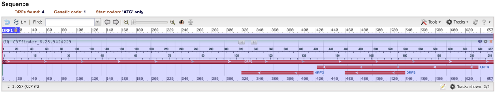
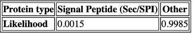
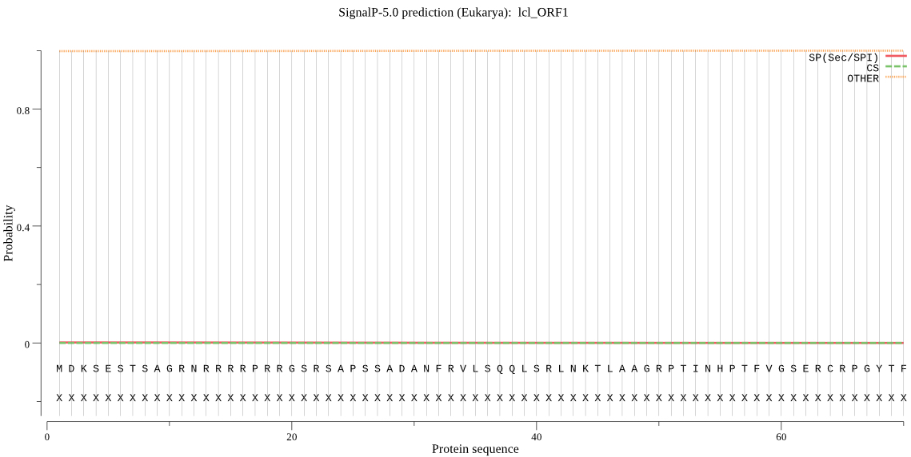
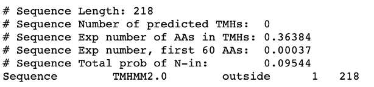
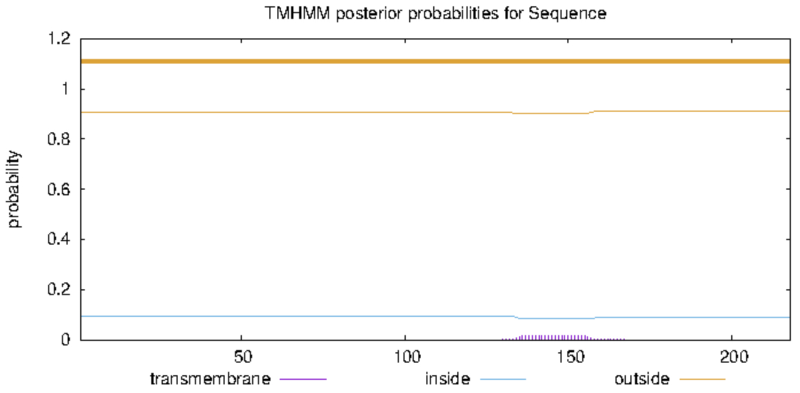
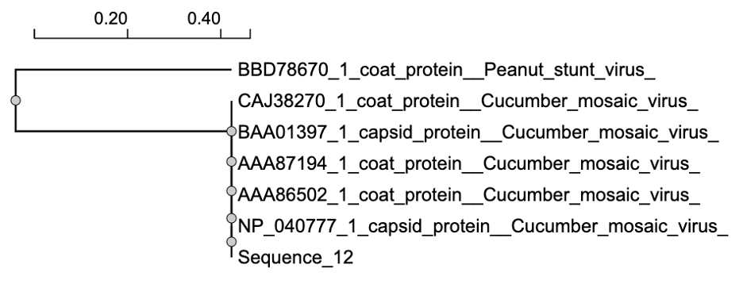

```{r setup, include=FALSE}
knitr::opts_chunk$set(echo = FALSE, message = FALSE, warning = FALSE)
```

```{css}
body {
  background-color: #88b3b3;
}

#molecular-biology-final-project {
  background-color: white;
  border-radius: 5px;
  margin: 15px;
  padding: 10px;
}
```

## [Home](https://annettelewis.github.io/) | [About Me](https://annettelewis.github.io/about_me/) | [Projects](https://annettelewis.github.io/projects/)

## Molecular Biology Final Project

### BIOL 3550

### Project write up 

I was assigned sequence 12 for this course project (*Table 1*). In this project write up, I will detail the different analyses I did to identify sequence 12 alongside the role of the sequence. To identify the gene product, I had to conduct various different analyses, including BLASTN, BLASTX, BLAST-P, CDD, ORF Finder, Signal-P, TMHMM, and PHYRE, and construct a cladogram using NGPhylogeny to identify the gene product. These analyses were conducted over the course of this semester to determine the gene product.
<br><br>

```{r}
library(knitr)
library(kableExtra)

seq12 <- data.frame(
  Sequence_12 = "ATGGACAAATCTGAATCAACCAGTGCTGGTCGTAACCGTCGACGTCGTCCGCGTCGTGGTTCCCGCTCCGCCCCCTCCTCCGCGGATGCTAACTTTAGAGTCTTGTCGCAGCAGCTTTCGCGACTTAATAAGACGTTAGCAGCTGGTCGTCCAACTATTAACCACCCAACCTTTGTAGGGAGTGAACGCTGTAGACCTGGGTACACGTTCACATCTATTACCCTAAAGCCACCAAAAATAGACCGTGGGTCTTATTACGGTAAAAGGTTGTTACTACCTGATTCAGTCACGGAATATGATAAGAAGCTTGTTTCGCGCATTCAAATTCGAGTTAATCCTTTGCCGAAATTTGATTCTACCGTGTGGGTGACAGTCCGTAAAGTTCCTGCCTCCTCGGACTTATCCGTTGCCGCCATCTCTGCTATGTTCGCGGACGGAGCCTCACCGGTACTGGTTTATCAGTATGCCGCATCTGGAGTCCAAGCCAACAACAAACTGTTGTATGATCTTTCGGCGATGCGCGCTGATATAGGTGACATGAGAAAGTACGCCGTCCTCGTGTATTCAAAAGACGATGCGCTCGAGACGGACGAGCTAGTACTTCATGTTGACATCGAGCACCAACGCATTCCCACATCTGGAGTGCTCCCAGTCTGAV")

seq12 %>%
  kable() %>%
  kable_classic(lightable_options = "hover") %>% 
  scroll_box(width = "800px")
``` 
**Table 1**. Sequence 12, the sequence that the analyses are based on. 
<br><br>

In my BLASTN analysis, I found that sequence 12 is most closely related to the cucumber mosaic virus (CMV) due to the high percent nucleotide identity that can be seen in *Table 2*. *Table 2* also demonstrates the percent amino acid identities of the same sequences identified in the BLASTN analysis for the BLASTX and BLAST-P results, respectively. I then ran a conserved domain database (CDD) analysis on sequence 12 and found that sequence 12 is conserved among the cucumo_coat superfamily with an interval of 38-201 (*Figure 1* and *Table 3*).
<br><br>

```{r}
data <- data.frame(
  Sequence = c("Cucumber mosaic virus RNA 3, complete sequence",
               "Cucumber mosaic virus truncated protein 3a and coat protein mRNA, complete cds",
               "Cucumber mosaic virus Ny coat protein gene, complete cds",
               "Cucumber mosaic virus genomic RNA, segment RNA 3, complete sequence, strain: Fny",
               "Cucumber mosaic virus partial 3a gene and partial cp gene for coat protein, genomic RNA, strain Le02 RNA3",
               "Peanut stunt virus Y11 genomic RNA, segment RNA3, complete sequence"),
  Genbank_Accession_Number = c("NC_001440.1", "U20668.1", "U22821.1", "D10538.1", "AM114273.1", "LC380695.1"),
  Percent_Nucleotide_Identity = c("100.0", "100.0", "100.0", "100.0", "99.85", "71.21"),
  Protein_ID_Number = c("NP_040777.1", "AAA86502.1", "AAA87194.1", "BAA01397.1", "CAJ38270.1", "BBD78670.1"),
  Percent_AA_Identity = c("100.00", "100.00", "100.00", "100.00", "100.00", "51.06"),
  BLAST_P_AA_Identity = c("100.00", "100.00", "100.00", "100.00", "100.00", "50.25")
)

data$Genbank_Accession_Number <- 
  sprintf("[%s](https://www.ncbi.nlm.nih.gov/nucleotide/%s?report=genbank&log$=nucltop&blast_rank=2&RID=8END3ZA5013)",
          data$Genbank_Accession_Number, data$Genbank_Accession_Number)
data$Protein_ID_Number <- 
  sprintf("[%s](https://www.ncbi.nlm.nih.gov/protein/%s)",
          data$Protein_ID_Number, data$Protein_ID_Number)

data %>%
  kable(format = "html") %>%
  kable_classic(lightable_options = "hover")
```

**Table 2**. The following table represents the BLASTN, BLASTX, and BLAST-P analyses associated with the assigned sequence 12. Five of the six sequences are closely related to sequence 12. This table includes the GenBank accession numbers of each sequence alongside their protein identification number. 
<br><br>

```{r}
 
``` 

**Figure 1**. Sequence 12 CDD analysis result demonstrating motif location (interval of 38-201). 
<br><br>

```{r}
data <- data.frame(
  Name = "Cucumo_coat super family",
  Accession = "cl08289",
  Description = "Cucumovirus coat protein",
  Interval = "38-201",
  E_value = "9.34e-101")

data$Accession <- 
  sprintf("[%s](https://www.ncbi.nlm.nih.gov/Structure/cdd/cddsrv.cgi?ascbin=8&maxaln=10&seltype=2&uid=cl08289)",
          data$Accession, data$Accession)

data %>%
  kable(format = "html") %>%
  kable_classic(lightable_options = "hover")
``` 

**Table 3**. CDD analysis results with the superfamily of sequence 12 identified.
<br><br>

Based on my assigned sequence, I conducted an open reading frame (ORF) finder analysis and could see four ORFs, as demonstrated in *Figure 2*. From this analysis, I identified ORF1 as the best ORF for sequence 12. The table below, *Table 4*, shows the protein translation of ORF1. 
<br><br>

```{r, out.width= 10000}
 
``` 

**Figure 2**. The proposed ORFs suggested by the ORF Finder analysis.  
<br>
```{r}
orf <- data.frame(
  Label = "ORF1",
  Protein_Translation = "MDKSESTSAGRNRRRRPRRGSRSAPSSADANFRVLSQQLSRLNKTLAAGR
PTINHPTFVGSERCRPGYTFTSITLKPPKIDRGSYYGKRLLLPDSVTEYD
KKLVSRIQIRVNPLPKFDSTVWVTVRKVPASSDLSVAAISAMFADGASPV
LVYQYAASGVQANNKLLYDLSAMRADIGDMRKYAVLVYSKDDALETDELV
LHVDIEHQRIPTSGVLPV")

orf %>%
  kable() %>%
  kable_classic(lightable_options = "hover")
``` 

**Table 4**. This table shows the amino acid sequence that belongs to ORF1. 
<br><br>

In my Signal-P analysis, *Table 5*, I used the translated protein sequence from ORF1, and I identified that my protein has an extremely low likelihood, 0.0015, of having a signal peptide. The Signal-P analysis looks for amino acid residues responsible for amino acid excretion or a membrane's presence. In this analysis, I determined that the virus I was assigned does not have a membrane and thus has no signals for Signal-P to find, as seen in *Figure 3*. In my TMHMM analysis, shown in *Figure 4* and *Figure 5*, I got a negative result, meaning that my virus does not have any strongly predicted transmembrane domains. 
<br><br>

```{r, out.width= 300}
 
``` 

**Table 5**. Signal-P analysis table denoting the likelihood of a signal peptide being present. 
<br><br>

```{r, fig.height= 301, fig.width = 600}
 
# 1139×572
``` 

**Figure 3**. Negative Signal-P analysis result. 
<br><br>

```{r, out.width= 500}
 
``` 

**Figure 4**. TMHMM analysis characteristics. 
<br><br><br>

```{r, out.width= 600}
 
# 2402×108
``` 

**Figure 5**. TMHMM analysis with a negative result. 
<br><br>

To obtain the predicted protein structure of the sequence, I conducted a PHYRE analysis. The result of this analysis can be seen in *Figure 6*. As can be observed, the predicted protein structure is rather small. 

```{r, out.width= 400}
knitr::include_graphics("../../media/final.casp.big.png") 
``` 

**Figure 6**. PHYRE analysis result. 
<br><br>

I constructed a cladogram based on the five sequences most and one least related to sequence 12, which I found in my BLAST analyses. As shown in *Figure 6*, the cladogram uses the coat protein of the peanut stunt virus as an outgroup. 

```{r, out.width= 600}

``` 

**Figure 6**. Cladogram based on sequences related to sequence 12 using the coat protein of the peanut stunt virus as an outgroup. 
<br><br>

In my analyses, I determined that sequence 12 is related to the CMV and is conserved in the cucumo_coat superfamily. In addition to this, the sequence that I was assigned does not have a membrane or any transmembrane domains that are strongly predicted. Due to these analyses, I found that this sequence is a part of the CMV coat protein. 

The primary function of the CMV coat protein is genome encapsidation, which forms a protective capsid around the viral RNA. The CMV coat protein also has other roles: movement (it facilitates virus movement both within cells and between different parts of the infected plant), aphid transmission (mediation of viral spread between host plants), host range determination (it influences the types of plants the virus can infect, contributing to its wide host range), and symptom induction on different plant species (contributing to the development of characteristic viral symptoms in infected plants). There is also evidence that the CMV coat protein is connected to symptom recovery, and its phosphorylation may be involved in this process. The CMV coat protein has a role in SAM (Shoot Apical Meristem) infections as well, where the coat protein has been found to play a role in determining viral invasion of the SAM in tobacco plants. 

The CMV coat protein is a central hub regulating connections between antiviral silencing and viral suppressor activities. Despite a limited number of viral proteins, the CMV coat protein has demonstrated a lot of versatility. 
<br><br><br>
**References** 

<style>
    .plain-link {
        color: black;
        text-decoration: none;
    }
</style>

Liu, S., He, X., Park, G., Josefsson, C., & Perry, K. L. (2002). A conserved capsid protein surface domain of cucumber mosaic virus is essential for efficient aphid vector transmission. Journal of Virology, 76(19), 9756–9762. <a class="plain-link" href="https://doi.org/10.1128/jvi.76.19.9756-9762.2002">https://doi.org/10.1128/jvi.76.19.9756-9762.2002</a>

Nemes, K., Gellért, Á., Bóka, K., Vági, P., & Salánki, K. (2019). Symptom recovery is affected by cucumber mosaic virus coat protein phosphorylation. Virology, 536, 68–77. <a class="plain-link" href="https://doi.org/10.1016/j.virol.2019.08.003">https://doi.org/10.1016/j.virol.2019.08.003</a>

Qiu, Y., Zhang, Y., Wang, C., Lei, R., Wu, Y., Li, X., & Zhu, S. (2018). Cucumber mosaic virus coat protein induces the development of chlorotic symptoms through interacting with the chloroplast ferredoxin I protein. Scientific Reports, 8(1). <a class="plain-link" href="https://doi.org/10.1038/s41598-018-19525-5">https://doi.org/10.1038/s41598-018-19525-5</a>

Zhang, X.-P., Liu, D.-S., Yan, T., Fang, X.-D., Dong, K., Xu, J., Wang, Y., Yu, J.-L., & Wang, X.-B. (2017). Cucumber mosaic virus coat protein modulates the accumulation of 2B protein and antiviral silencing that causes symptom recovery in Planta. PLOS Pathogens, 13(7). <a class="plain-link" href="https://doi.org/10.1371/journal.ppat.1006522">https://doi.org/10.1371/journal.ppat.1006522</a>

```{bash, message = FALSE, include = FALSE}
git add index.Rmd
git commit -m "automatic"
git push
```