```{r setup, include=FALSE}
knitr::opts_chunk$set(echo = FALSE, message = FALSE, warning = FALSE)
```

```{css}
body {
  background-color: lightblue;
}

#photos {
  background-color: white;
  border-radius: 5px;
  margin: 15px;
  padding: 10px;
}
#abstract{
  background-color: white;
  border-radius: 5px;
  margin: 15px;
  padding: 10px;
}
#methods {
  background-color: white;
  border-radius: 5px;
  margin: 15px;
  padding: 10px;
}
#phylogenetic-tree {
  background-color: white;
  border-radius: 5px;
  margin: 15px;
  padding: 10px;
}
#combinations {
  background-color: white;
  border-radius: 5px;
  margin: 15px;
  padding: 10px;
}
#branch-lengths {
  background-color: white;
  border-radius: 5px;
  margin: 15px;
  padding: 10px;
}
#experimental-results {
  background-color: white;
  border-radius: 5px;
  margin: 15px;
  padding: 10px;
}
#additional-information {
  background-color: white;
  border-radius: 5px;
  margin: 15px;
  padding: 10px;
}
#not-as-good-graphs {
  background-color: white;
  border-radius: 5px;
  margin: 15px;
  padding: 10px;
}

<style>
.scrollable-gallery {
  overflow-x: auto; /* Horizontal scrolling */
  white-space: nowrap; /* Keep images in a single line */
  padding: 10px 0;
}

.scrollable-gallery img {
  display: inline-block;
  margin-right: 10px; /* Space between images */
  vertical-align: middle;
  width: 30%; /* Adjust image size as needed */
}
</style>

<div class="scrollable-gallery">
```

## [Home](https://annettelewis.github.io/) | [About Me](https://annettelewis.github.io/about_me/) | [Projects](https://annettelewis.github.io/projects/)

## **Photos**

```{r photo-gallery, echo=FALSE, out.width='100%', fig.show='hold', out.extra='style="width:30%;"'}
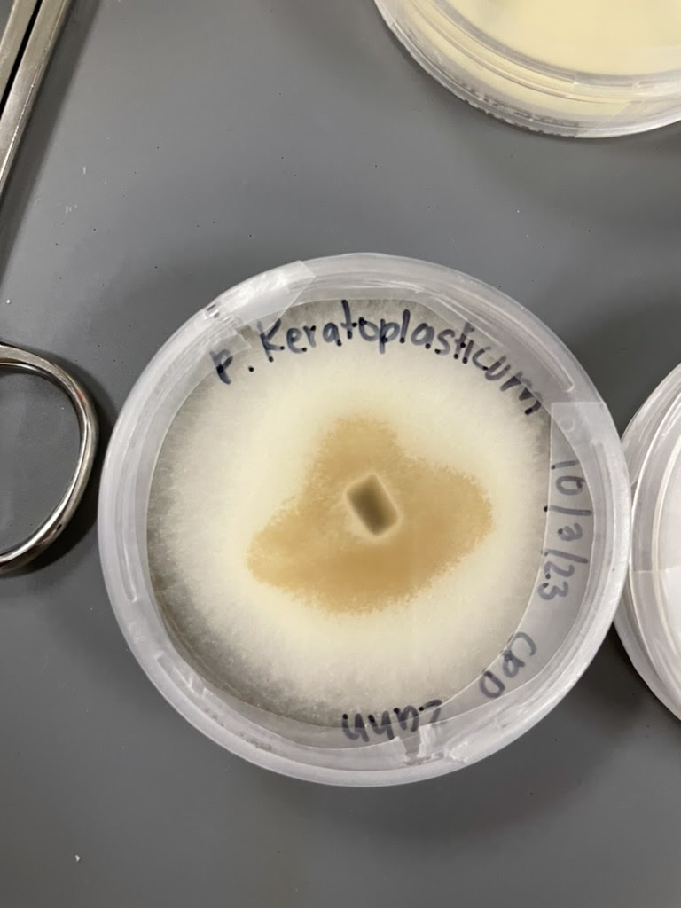
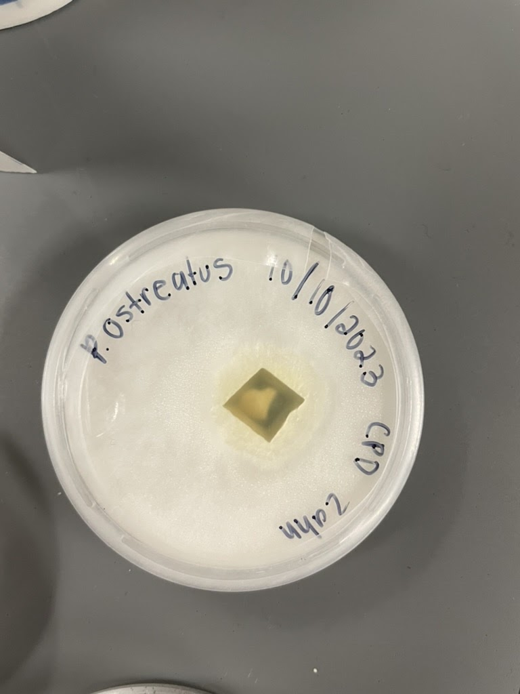
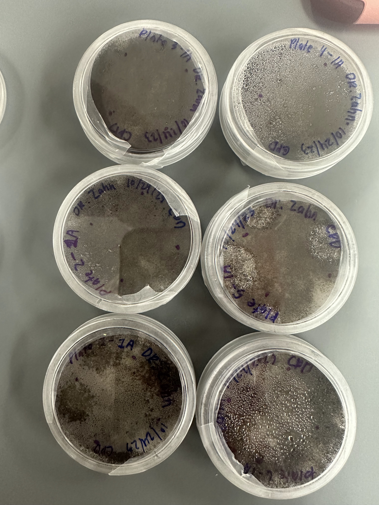 #?
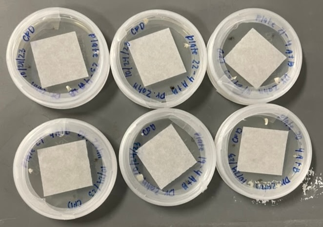
knitr::include_graphics("../../media/fungi/img_0046.jpg")
knitr::include_graphics("../../media/fungi/img_0132.jpg")
knitr::include_graphics("../../media/fungi/img_0138.jpg")
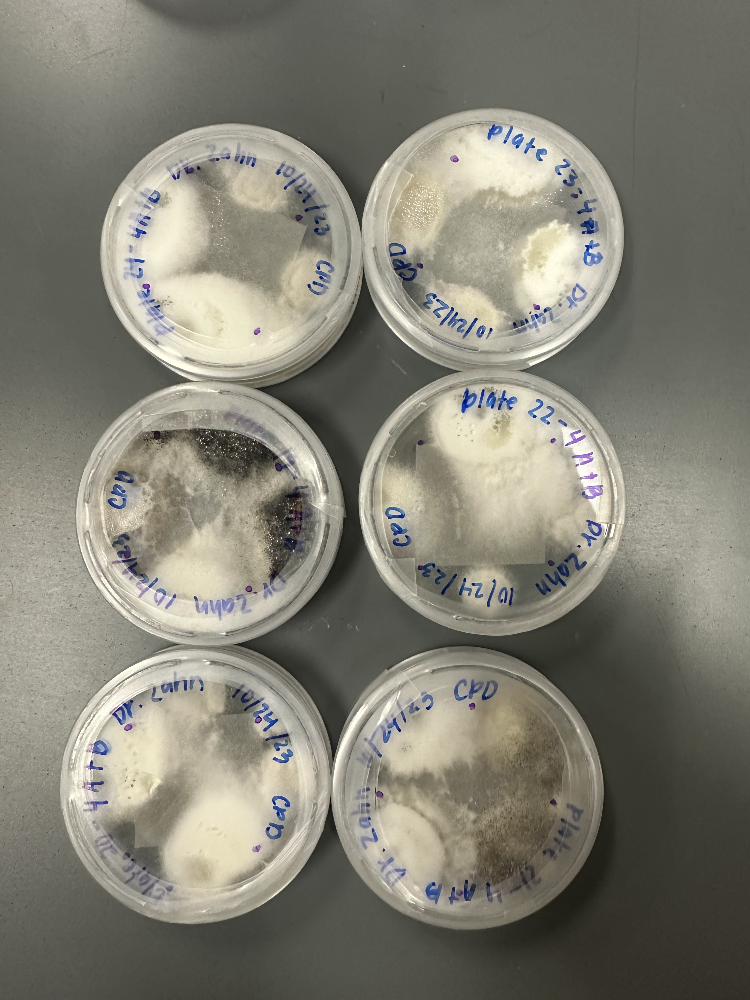
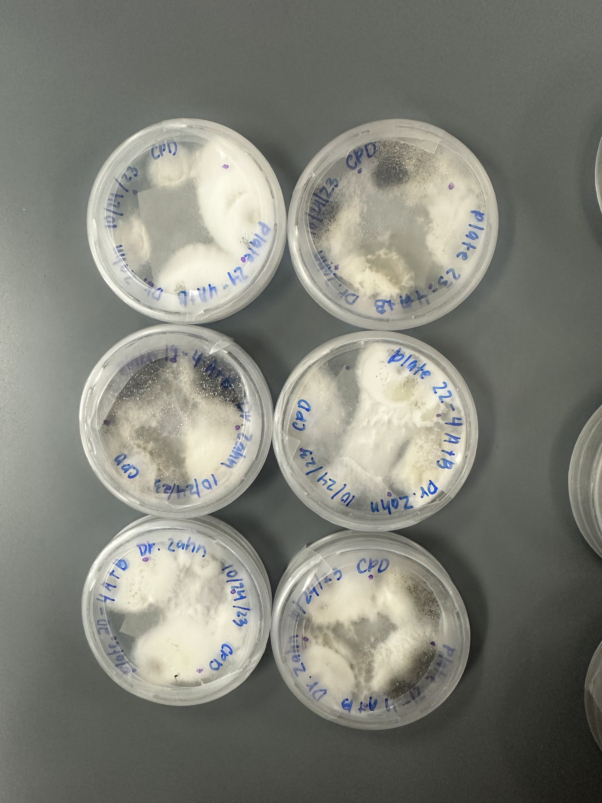
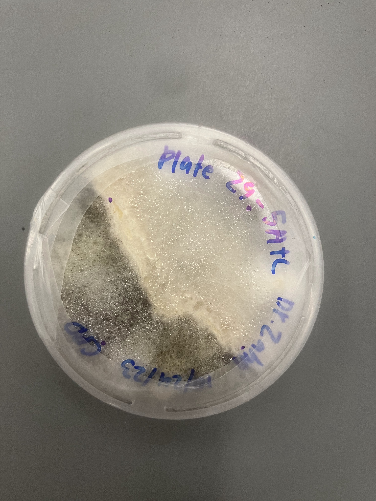
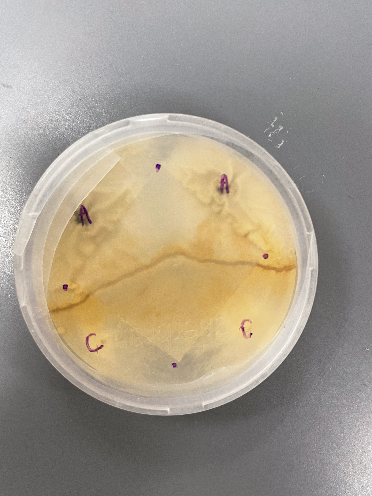
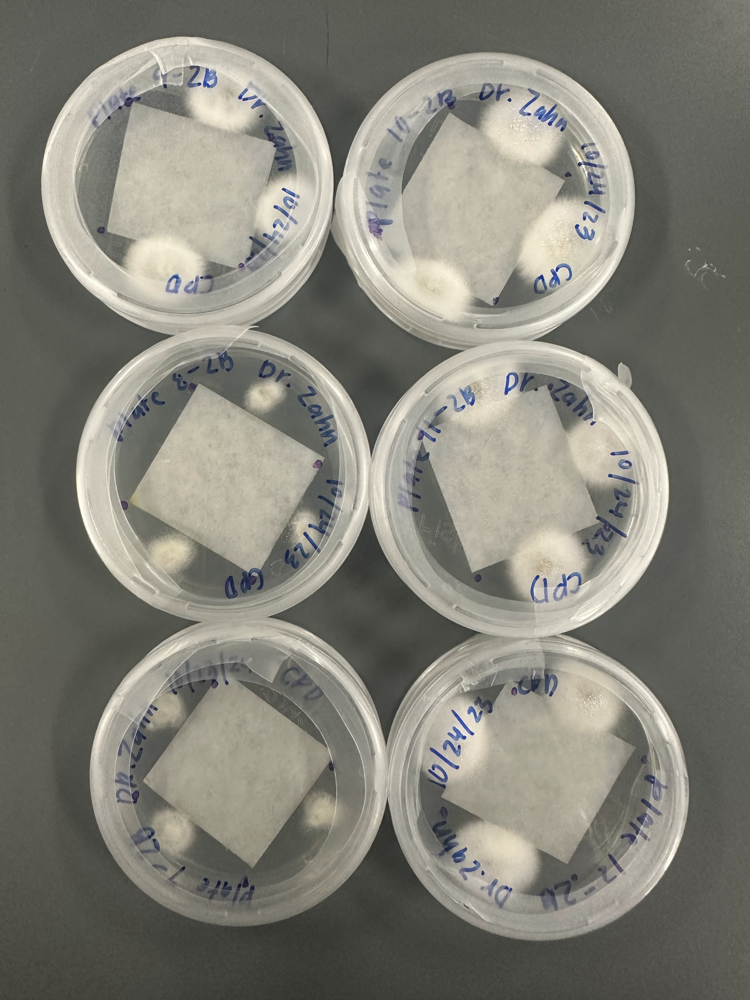
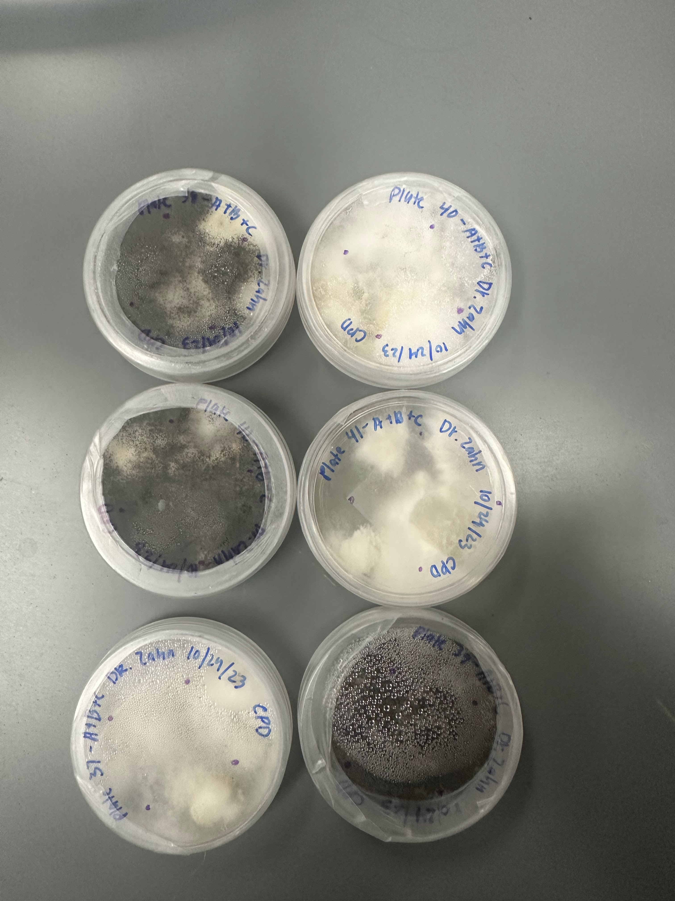
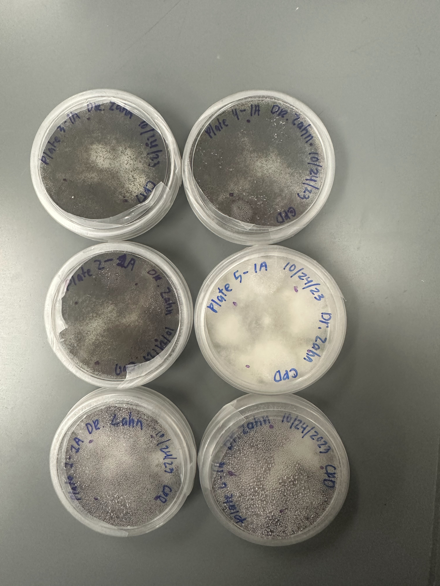
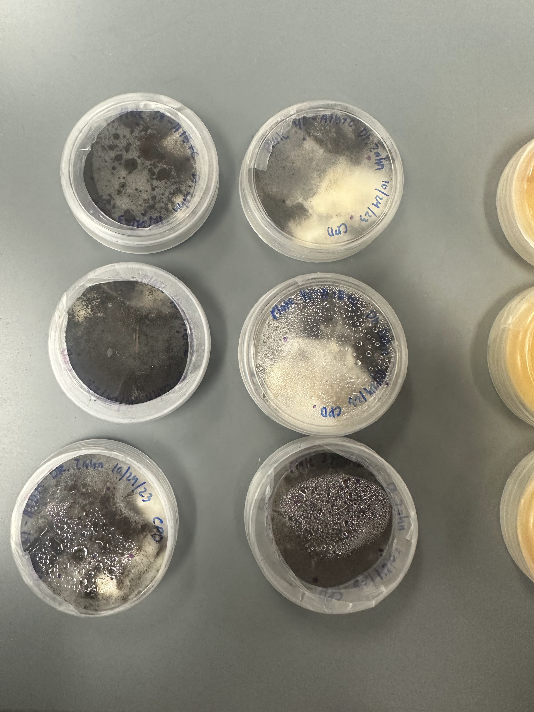
```

</div>

```{r}
# additional photos, a lot of these don't work
# knitr::include_graphics("../../media/fungi/IMG_9714.heic") #not owrking
# knitr::include_graphics("../../media/fungi/IMG_9697.heic") #not owrking
# 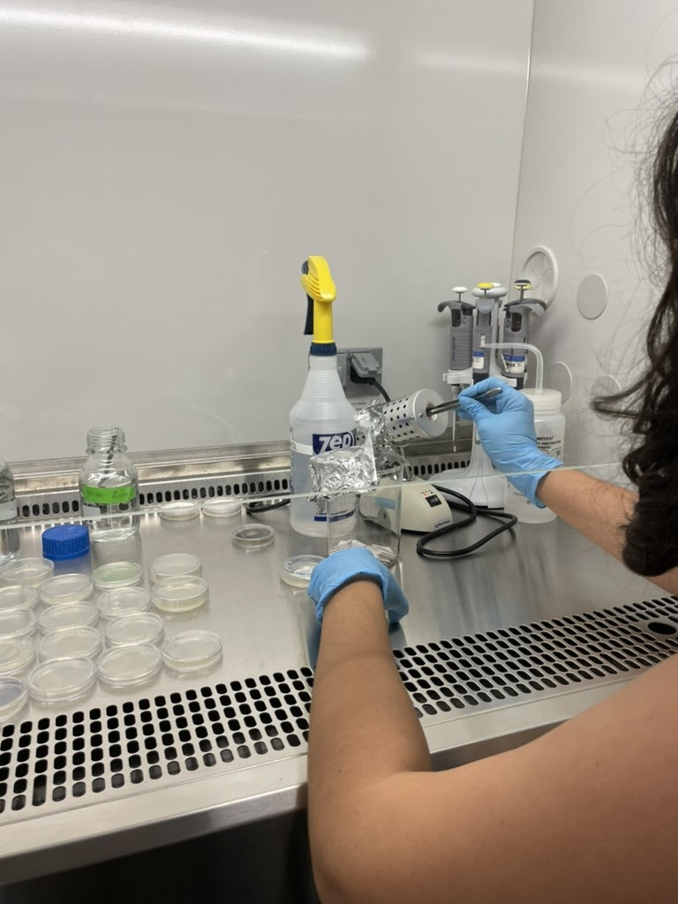
# knitr::include_graphics("../../media/fungi/IMG_9892.heic")
# 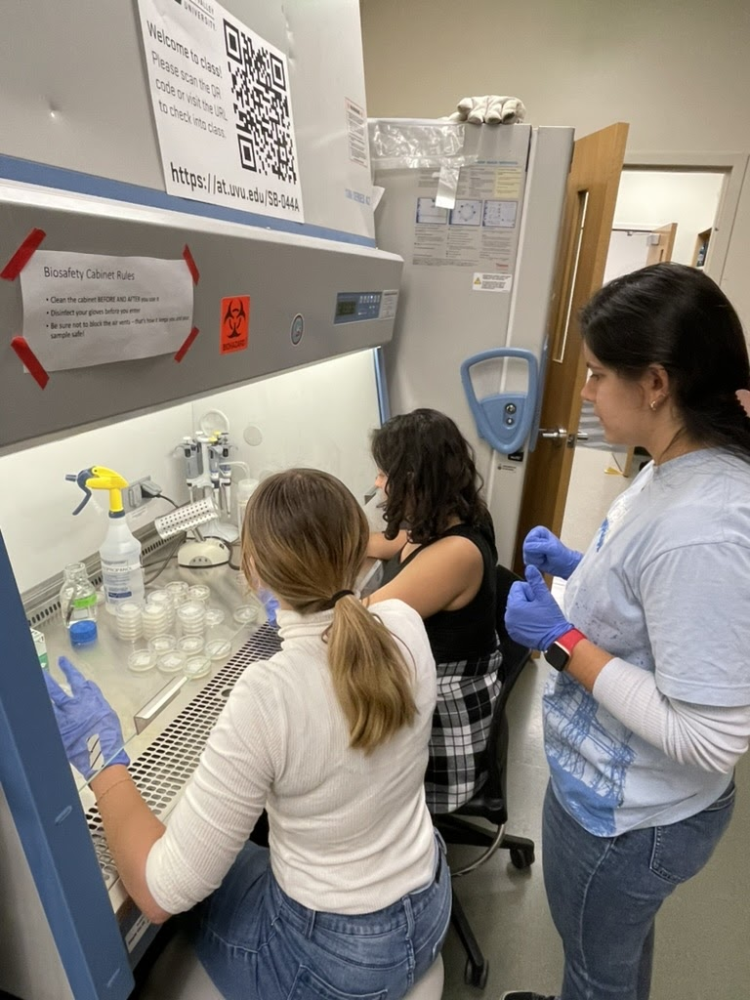 #
#  #
```

## **Abstract**

**Does Greater Phylogenetic Distance Affect Competition Outcomes in Fungal Communities?**

Annette Lewis, Kendall Holcomb, Bárbara Suassuna Schincariol, Josh Stubbs, Geoffery Zahn PhD

Fungi play a critical role in decomposition, affecting nutrient cycling at a global scale. Saprotrophic fungi competitively decompose dead organic matter. However, the role of phylogenetic relatedness on interspecific competition in fungal communities has not received much attention. The theory of phylogenetic over-dispersion suggests that species within a community tend to be less related than expected by chance, therefore limiting competition due to functional redundancy. Similarly, Darwin’s naturalization hypothesis suggests that taxonomically distinct invaders might experience reduced competition and resistance. In this study, we chose three different saprotrophic fungal species with varying relatedness: *Aspergillus niger* and *Fusarium keratoplasticum* (from the same family), and *Pleurotus ostreatus* (from a different phylum). These species were chosen based on decomposition abilities and phylogenetic distances. These species were cultured and placed in seven combinations to assess their ability to decompose and compete as individual fungal populations and as combined communities (e.g., A, B, A+B, B+C, and A+B+C). Each species was placed near a sterilized piece of paper such that competition was evaluated by analyzing the paper coverage in Petri dishes over three weeks. Each Petri dish was analyzed individually based on the average percentage of paper covered and, within combined communities, the percentage of paper each species covered. Interactions between each species and the percentage of the paper covered was recorded for further analysis. Assessing paper coverage allows for the observation of any potential competitive inhibition of decomposition. We hypothesize that decomposing and competitive abilities would be the strongest with *A. niger*. Despite the fast growth rate of *A. niger* individually, preliminary results suggest that it was outcompeted when paired with other species. This research highlights the potential nuances in fungal community interactions influenced by phylogenetic relationships, shedding light on the principles of phylogenetic overdispersion and Darwin’s naturalization hypothesis.

## **Methods**

We used three saprophytic fungal species *Aspergillus niger*, *Fusarium keratoplasticum*, and *Pleurotus ostreatus*. *A. niger* and *F. keratoplasticum* will be purchased from ATCC.org as freeze-dried and frozen samples. *P. ostreatus* was already available from Dr. Zahn’s laboratory. These fungal species will then be cultured in Petri dishes.

```{r}
knitr::include_graphics("./Screenshot 2023-10-01 at 9.35.22 PM.png")
```

The cultured fungal samples will be placed in **7 combinations** to test their ability to decompose as individual fungi populations and combined communities. For each of the combinations, there will be six replicates. 

*The sterilized paper's dimensions are: 1in by 1in*

Alongside our results, we will obtain genetic information based on the ITS1 gene in GenBank and construct a phylogenetic tree. We will calculate the phylogenetic relatedness of our species via branch length distance, using ape 5.0 in R. This portion of the research will be conducted to observe species' phylogenetic diversity and decomposition abilities. 

```{r}
knitr::include_graphics("./Screenshot 2023-10-01 at 9.37.35 PM.png")
```

```{r}
# Load in libraries
library(ape)
library(phangorn)
library(ggplot2)
library(tidyverse)
library(kableExtra)
library(plotly)
library(patchwork)
library(dplyr)
library(tidyr)
library(gridExtra)
library(easystats)
theme_set(theme_minimal())
```

### **Phylogenetic tree**

Initial phylogenetic tree setup. The sequences were obtained from the NCBI, based on the ITS region, and aligned using the EMBL-EBI's Multiple Sequence Alignment tool, MUSCLE. This tree has no outgroup selected and serves to show the most basic form of this tree.

```{r}
alignment_file <- "./3_muscle_alignment.fasta"
fungi <- read.phyDat(alignment_file, format = "fasta")
dist_matrix <- dist.ml(fungi, model = "JC69")
nj_tree <- nj(dist_matrix)
# Extract species names from the tip labels
species_names <- sapply(strsplit(nj_tree$tip.label, " "), function(x) paste(x[1:2], collapse = " "))

# Update the labels of the rooted tree
nj_tree$tip.label <- species_names

# Replace these placeholders with the actual species names in the same order as your tip labels
species_names <- c(
  "Aspergillus niger",
  "Fusarium keratoplasticum",
  "Pleurotus ostreatus",
  "Pericharax heteroraphis"
)
nj_tree$tip.label <- species_names
outgroup_name <- "Pericharax heteroraphis"
outgroup_index <- which(nj_tree$tip.label == outgroup_name)
nj_tree_rooted <- root(nj_tree, outgroup_index)
```

Phylogenetic tree rooted on *Pericharax heteroraphis*, a sea sponge, including species names.

```{r}
plot(nj_tree_rooted)
```

## **Combinations**

The different combinations we plan to test:

```{r, include = TRUE, message = TRUE}
# Test for different combinations
species_combinations <- list(
  "Aspergillus niger", #A
  "Fusarium keratoplasticum", #B
  "Pleurotus ostreatus", #C
  c("Aspergillus niger", "Fusarium keratoplasticum"), #A+B
  c("Aspergillus niger", "Pleurotus ostreatus"), #A+C
  c("Fusarium keratoplasticum", "Pleurotus ostreatus"), #B+C
  c("Aspergillus niger", "Fusarium keratoplasticum", "Pleurotus ostreatus") #A+B+C
)

df <- data.frame(
  Species =  c("Aspergillus niger", #A
  "Fusarium keratoplasticum", #B
  "Pleurotus ostreatus", #C
  "Aspergillus niger and Fusarium keratoplasticum", #A+B
  "Aspergillus niger and Pleurotus ostreatus", #A+C
  "Fusarium keratoplasticum and Pleurotus ostreatus", #B+C
  "Aspergillus niger, Fusarium keratoplasticum, and Pleurotus ostreatus"), #A+B+C 
  Combination = c("A", "B", "C", "A+B", "A+C", "B+C", "A+B+C")
)

df %>% kable() %>% 
  kable_classic(lightable_options = "hover") %>%
  scroll_box(height = "200px")
```

## **Branch lengths**

```{r}
# Function to calculate branch lengths based on the sea sponge
compute_branch_length <- function(species_combination, nj_tree_rooted, outgroup) {
  species_to_keep <- union(species_combination, outgroup)
  sub_tree <- drop.tip(nj_tree_rooted, setdiff(nj_tree_rooted$tip.label, species_to_keep))
  sub_tree <- drop.tip(sub_tree, outgroup)
  sum(sub_tree$edge.length)
}

# Function to calculate branch lengths (general)
compute_branch_length_gen <- function(species_combination, nj_tree_rooted, outgroup) {
   species_to_keep <- union(species_combination, outgroup)
   sub_tree <- drop.tip(nj_tree_rooted, setdiff(nj_tree_rooted$tip.label, species_to_keep))
   return(sum(sub_tree$edge.length))
}
```

```{r}
results <- sapply(species_combinations, FUN = compute_branch_length, nj_tree_rooted = nj_tree_rooted, outgroup = outgroup_name)

species_combinations_str <- sapply(species_combinations, function(x) paste(x, collapse=", "))

results_gen <- sapply(species_combinations, FUN = compute_branch_length_gen, nj_tree_rooted = nj_tree_rooted, outgroup = outgroup_name)
```

**Main**. Compute branch lengths based on our sea sponge, *Pleurotus ostreatus*. In this, the branch lengths associated with the outgroup are excluded here after using it to root the tree.

```{r}
results_tbl <- tibble(Species=species_combinations_str, Combination=df$Combination, Branch_Length=results)
# Table with branch lengths where branch lengths associated with the outgroup "Pericharax heteroraphis" were removed
results_tbl %>% kable() %>%
  kable_classic(lightable_options = "hover") %>%
  scroll_box(height = "200px")
summary(results_tbl$Branch_Length)
sd(results_tbl$Branch_Length)
```

<br>

**General**. Below shows the general branch length values where the outgroup's branch length is kept in the final calculation.

```{r}
results_gen_tbl <- tibble(Species=species_combinations_str, Combination=df$Combination, Branch_Length=results_gen)
# Table with branch lengths based on the outgroup "Pericharax heteroraphis"
results_gen_tbl %>% 
  kable() %>%
  kable_classic(lightable_options = "hover") %>%
  scroll_box(height = "200px")
summary(results_gen_tbl$Branch_Length)
sd(results_gen_tbl$Branch_Length)
```

*Our plan will be to stick with this one as the branch lengths here have a slightly larger standard deviation, but this difference is negligible*

## **Experimental results**

```{r}
new <- data.frame(
  Species =  c("Aspergillus niger", #A
  "Fusarium keratoplasticum", #B
  "Pleurotus ostreatus", #C
  "Aspergillus niger and Fusarium keratoplasticum", #A+B
  "Aspergillus niger and Pleurotus ostreatus", #A+C
  "Fusarium keratoplasticum and Pleurotus ostreatus", #B+C
  "Aspergillus niger, Fusarium keratoplasticum, and Pleurotus ostreatus"),
Species_short =  c("A. niger", #A
  "F. keratoplasticum", #B
  "P. ostreatus", #C
  "A. niger and F. keratoplasticum", #A+B
  "A. niger and P. ostreatus", #A+C
  "F. keratoplasticum and P. ostreatus", #B+C
  "A. niger, F. keratoplasticum, and P. ostreatus"))
merged_data <- merge(results_gen_tbl, new, by = "Species")

df <- results_gen_tbl %>%
  ggplot(aes(x = reorder(Combination, Branch_Length, increasing = TRUE), y = Branch_Length)) +
  geom_point() +
  theme_classic() +
  labs(title = "Branch length based on species combination",
       x = "Species combination",
       y = "Branch length", 
       legend = labs(title = "Legend Title",
                     color = "Combination",
                     shape = "Species")) +
  theme(axis.text.x = element_text(face = "italic"))

ggplotly(df)

w1 <- df
```

```{r}
data <- read.csv("./Community_Diversity_Phylogeny_Decomposition - main_sheet.csv")
```

### Line plot

```{r}
# Week numbers
data <- data %>%
  arrange(date) %>%
  mutate(week = paste("Week", dense_rank(date) - 1))

# # Line plot over time:
# time_series_data <- data %>%
#   group_by(week, combinations, species) %>%
#   summarise(mean_species_coverage = mean(species_coverage, na.rm = TRUE))
# 
# ggplot(time_series_data, aes(x = week, y = mean_species_coverage, color = combinations, linetype = species)) +
#   geom_line(aes(group = interaction(combinations, species))) +
#   ylim(0, 100) +
#   labs(title = "Mean Species Coverage Over Time", y = "Mean Species Coverage (%)", x = "Week")
```

```{r}
# Line plot over time for combinations only:
time_series_combinations <- data %>%
  group_by(week, combinations) %>%
  summarise(mean_species_coverage = mean(species_coverage, na.rm = TRUE))

ggplot(time_series_combinations, aes(x = week, y = mean_species_coverage, color = combinations)) +
  geom_line(aes(group = combinations)) +
  ylim(0, 100) +
  labs(title = "Mean Species Coverage Over Time by Combinations", y = "Mean Species Coverage (%)", x = "Week")
```

### Individual species coverage

```{r}
# Now you can use the 'week' column in your ggplot2 plots
grouped_week_data <- data %>%
  group_by(week, combinations, species) %>%
  summarise(mean_species_coverage = mean(species_coverage, na.rm = TRUE)) %>% 
  filter(week != "Week 0")

q1 <- ggplot(grouped_week_data, aes(x = combinations, y = mean_species_coverage, fill = species)) +
  geom_bar(stat = 'identity', position = 'dodge') +
  ylim(0, 100) +
  labs(y = "Mean Species Coverage (%)", x = "Combinations") +
  facet_wrap(~ week, ncol = 1)

q1
```

Alphabetical

```{r}
data$combinations <- factor(data$combinations, levels = c("A", "B", "C", "A+B", "A+C", "B+C", "A+B+C"))

grouped_week_data_alpha <- data %>%
  group_by(week, combinations, species) %>%
  summarise(mean_species_coverage = mean(species_coverage, na.rm = TRUE)) %>%
  filter(week != "Week 0")

# Create the ggplot with the grouped_week_data_alpha dataframe
q2 <- ggplot(grouped_week_data_alpha, aes(x = combinations, y = mean_species_coverage, fill = species)) +
  geom_bar(stat = 'identity', position = 'dodge') +
  ylim(0, 100) +
  labs(y = "Mean Species Coverage (%)", x = "Combinations") +
  facet_wrap(~ week, ncol = 1)

q2
```

Bond Length

```{r}
# Organize bond length in ascending order
bond_length_order <- data %>%
  group_by(combinations) %>%
  summarise(avg_bond_length = mean(branch_length, na.rm = TRUE)) %>%
  arrange(avg_bond_length) %>%
  pull(combinations)

data$combinations <- factor(data$combinations, levels = bond_length_order)

grouped_week_data_bond <- data %>%
  group_by(week, combinations, species) %>%
  summarise(mean_species_coverage = mean(species_coverage, na.rm = TRUE)) %>%
  filter(week != "Week 0")

# Create the ggplot with the grouped_week_data_bond dataframe
q3 <- ggplot(grouped_week_data_bond, aes(x = combinations, y = mean_species_coverage, fill = species)) +
  geom_bar(stat = 'identity', position = 'dodge') +
  ylim(0, 100) +
  labs(y = "Mean Species Coverage (%)", x = "Combinations") +
  facet_wrap(~ week, ncol = 1)

q3
```

### Total combination coverage

```{r}
data$combinations <- as.character(data$combinations)

data <- data %>%
  mutate(week = as.numeric(as.factor(date)) - 1) %>%
  mutate(week = paste0("Week ", week))

grouped_week_data <- data %>%
  group_by(week, combinations) %>%
  summarise(mean_total_coverage = mean(total_coverage, na.rm = TRUE)) %>%
  filter(week != "Week 0")

r1 <- ggplot(grouped_week_data, aes(x = combinations, y = mean_total_coverage, fill = combinations)) +
  geom_bar(stat = 'identity', position = 'dodge') +
  ylim(0, 100) +
  labs(y = "Mean Total Coverage (%)", x = "Combinations") +
  facet_wrap(~ week, ncol = 1)

r1
```

Alphabetical

```{r}
data$combinations <- factor(data$combinations, levels = c("A", "B", "C", "A+B", "A+C", "B+C", "A+B+C"))

grouped_week_data_total <- data %>%
  group_by(week, combinations) %>%
  summarise(mean_total_coverage = mean(total_coverage, na.rm = TRUE)) %>%
  filter(week != "Week 0")  # Exclude Week 0

# Create the second plot (p2) for total coverage
r2 <- ggplot(grouped_week_data_total, aes(x = combinations, y = mean_total_coverage, fill = combinations)) +
  geom_bar(stat = 'identity', position = 'dodge') +
  ylim(0, 100) +
  labs(y = "Mean Total Coverage (%)", x = "Combinations") +
  facet_wrap(~ week, ncol = 1)

r2
```

Bond Length

```{r}
bond_length_order <- data %>%
  group_by(combinations) %>%
  summarise(avg_bond_length = mean(branch_length, na.rm = TRUE)) %>%
  arrange(avg_bond_length) %>%
  pull(combinations)  # Extract the ordered combinations

# Reorder combinations as a factor with levels based on bond lengths
data$combinations <- factor(data$combinations, levels = bond_length_order)

data <- data %>%
  mutate(date = as.Date(date)) %>%
  arrange(date) %>%
  mutate(week = paste("Week", dense_rank(date)))

# Calculate mean total coverage for each combination, grouped by week
grouped_week_data_total <- data %>%
  group_by(week, combinations) %>%
  summarise(mean_total_coverage = mean(total_coverage, na.rm = TRUE)) %>%
  filter(week != "Week 1")  # Assuming Week 1 is the baseline and you want to exclude it

# Create a bar plot with the grouped_week_data_total
r3 <- ggplot(grouped_week_data_total, aes(x = combinations, y = mean_total_coverage, fill = combinations)) +
  geom_bar(stat = 'identity', position = 'dodge') +
  ylim(0, 100) +
  labs(y = "Mean Total Coverage (%)", x = "Combinations") +
  facet_wrap(~ week, ncol = 1)

r3
```

## **Additional information**

```{r}
q1 <- q1 + theme(axis.text.x = element_text(angle = 50, hjust = 1))
r1 <- r1 + theme(axis.text.x = element_text(angle = 50, hjust = 1))

q2 <- q2 + theme(axis.text.x = element_text(angle = 50, hjust = 1))
r2 <- r2 + theme(axis.text.x = element_text(angle = 50, hjust = 1))

q3 <- q3 + theme(axis.text.x = element_text(angle = 50, hjust = 1))
r3 <- r3 + theme(axis.text.x = element_text(angle = 50, hjust = 1))

q1 + r1
```

Alphabet

```{r}
q2 + r2
```

Bond length

```{r}
q3 + r3
```

Scatterplot showing that there seems to be no relationship with total coverage:

```{r}
combination_data <- data %>%
  group_by(combinations) %>%
  summarise(branch_length = mean(branch_length, na.rm = TRUE),
            total_coverage = mean(total_coverage, na.rm = TRUE),
            species_coverage = mean(species_coverage, na.rm = TRUE))

# Calculate the average branch length for each combination and set the order
branch_length_order <- combination_data %>%
  arrange(branch_length) %>%
  pull(combinations)

# Reorder combinations as a factor with levels based on branch lengths
combination_data$combinations <- factor(combination_data$combinations, levels = branch_length_order)

# Now create all three plots using the ordered combinations

# Total Species Coverage by Branch Length
p1 <- ggplot(combination_data, aes(x = combinations, y = total_coverage, label = combinations)) +
  geom_point(aes(color = combinations), size = 4) +
  geom_text(nudge_y = 1, check_overlap = TRUE) +  # Adjust nudge_y as needed to avoid overlap
  labs(title = "Total Species Coverage by Branch Length",
       x = "Combination",
       y = "Total Species Coverage (%)") +
  theme(legend.title = element_blank())

# Species Coverage by Branch Length
p2 <- ggplot(combination_data, aes(x = branch_length, y = species_coverage, label = combinations)) +
  geom_point(aes(color = combinations), size = 4) +
  geom_text(nudge_y = 1, check_overlap = TRUE) +  # Adjust nudge_y as needed to avoid overlap
  labs(title = "Species Coverage by Branch Length",
       x = "Combination",
       y = "Species Coverage (%)") +
  theme(legend.title = element_blank()) + 
  geom_smooth(method = "lm", se = FALSE)

p1
p2

p1 + p2
```
```{r}
model <- lm(species_coverage ~ branch_length, data = data)

# display equation with p-value and R^2 value
coefficients <- coef(model)
intercept <- coefficients[1]
slope <- coefficients[2]
r_squared <- summary(model)$r.squared
p_value <- summary(model)$coefficients[2,4]

equation_text <- paste("y = ", round(intercept, 2), " + ", round(slope, 2), "x\n",
                       "R² = ", round(r_squared, 2), 
                       ", p = ", formatC(p_value, format = "e", digits = 2))

p2 <- ggplot(combination_data, aes(x = branch_length, y = species_coverage)) +
  geom_point(aes(color = combinations), size = 4) +
  geom_text(aes(label = combinations), nudge_y = 1, check_overlap = TRUE) +
  labs(title = "Species Coverage by Branch Length",
       x = "Branch Length",
       y = "Species Coverage (%)") +
  theme(legend.title = element_blank()) +
  geom_smooth(method = "lm", se = FALSE) +
  annotate("text", x = Inf, y = Inf, label = equation_text, hjust = 1, vjust = 1, size = 3.5)

p2


model1 <- lm(species_coverage ~ branch_length + combinations, data = data)
model2 <- lm(total_coverage ~ branch_length + combinations, data = data)


summary(model2)

check_model(model1)
check_model(model2)

performance(model2)
```

---

```{r}
#----

library(ggplot2)
library(dplyr)

# Calculate the mean of total coverage and branch length for each combination
combination_data <- data %>%
  group_by(combinations) %>%
  summarise(branch_length = mean(branch_length, na.rm = TRUE),
            mean_species_coverage = mean(species_coverage, na.rm = TRUE),
            total_coverage = mean(total_coverage, na.rm = TRUE))

# Create a scatter plot
ggplot(combination_data, aes(x = branch_length, y = mean_species_coverage, size = total_coverage)) +
  geom_point(aes(color = combinations), alpha = 0.7) +
  scale_size_continuous(name = "Total Coverage", range = c(3, 10)) +
  labs(title = "Branch Length and Species Coverage by Combinations",
       x = "Branch Length",
       y = "Mean Species Coverage (%)") +
  theme(legend.title = element_blank())
```