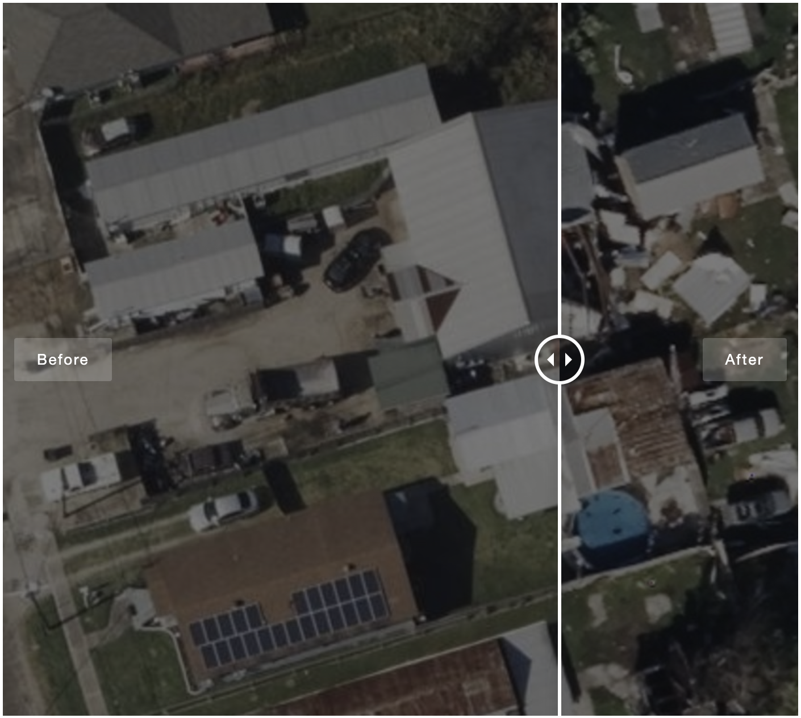
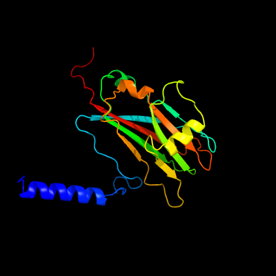

```{r setup, include=FALSE}
knitr::opts_chunk$set(echo = FALSE, message = FALSE, warning = FALSE)
```

## [Home](https://annettelewis.github.io/) | [About Me](https://annettelewis.github.io/about_me/)

---

## Projects

### Data Science for Biologists: [Final Project](https://annettelewis.github.io/projects/BIOL_3100_final_project/)
```{r, out.width= 350, out.height= 350}
 
# 1410 x 1266
``` 

### Molecular Biology: [Final Project](https://annettelewis.github.io/projects/BIOL_3550_final_project/)
```{r}
 
``` 

---

**Courses/Certifications:**

[Course: Artificial Intelligence in Bioinformatics](https://www.futurelearn.com/courses/artificial-intelligence-in-bioinformatics/3/todo/167078)

[Course: Clinical Bioinformatics](https://www.futurelearn.com/courses/bioinformatics/10/todo/73533)

[Course: Introductory Bioinformatics](https://www.ebi.ac.uk/training/online/courses/introductory-bioinformatics-pathway/#vf-tabs__section--overview)

[Codeacademy](https://www.codecademy.com/catalog)

```{bash, message = FALSE, include = FALSE}
git add index.Rmd
git commit -m "automatic"
git push
```